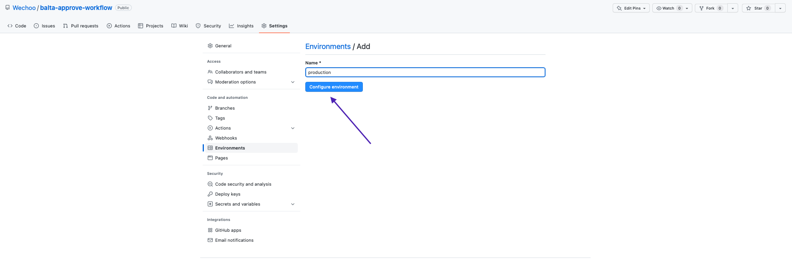

# Adicionando etapa de aprovação em um fluxo de trabalho no Github Actions

# Introdução

O GitHub Actions é uma ferramenta de fluxo de trabalho (*workflow*) presente no GitHub que permite a automação de nosso fluxo de integração. Neste artigo, vamos apresentar como adicionar uma etapa manual de aprovação em um fluxo de trabalho.

A nossa finalidade será adicionar as configurações requeridas para atingir o objetivo de anterior a um processo ser executado, ele solicitar um review para uma lista pré definida de usuários que podem aprovar o fluxo conforme apresentado na imagem abaixo, em que aparece um box amarelo solicitando a revisão.


Os tópicos serão apresentados:

1. Contexto
    - Adicionando o fluxo de trabalho
2. Adicionando a etapa de aprovação
    - Adicionando a configuração de ambiente
    - Adicionando a configuração no seu workflow
    - Visualizando o resultado
3. Recapitulando
4. Referências

# Contexto

A automação do processo das etapas de entrega e implementação de uma aplicação (backend, frontend, mobile) é feita através de um processo chamado de CI/CD (Continuous Integration / Continuous Delivery). As etapas são criadas de acordo com as necessidades do seu projeto. Essas etapas são executadas seguindo a ordem que foi definida no seu processo de automação podendo ter dependências entre elas, como por exemplo, uma etapa de testes precisa ser executada antes de realizar o build da aplicação, caso seja executada com falha, o fluxo é interrompido.

Para contextualizar e exemplificar o processo de adição da etapa de aprovação, vamos criar e adicionar a base a seguir.

## Adicionando o fluxo de trabalho

Em seu repositório criado no GitHub, o nosso exemplo será disponibilizado neste [link](https://github.com/Wechoo/balta-approve-workflow), realize as etapas:

1. Dentro do repositório do Github, crie um diretório `.github/workflows`.
2. No diretório `.github/workflows`, crie um arquivo `main.yaml` com o conteúdo a seguir: 

.github/workflows/main.yaml

```yaml
---
name: Running

on:
  push: # quando o push for feito para a master
    branches:
      - master

jobs:
  dev:
    runs-on: ubuntu-latest

    steps:
      - name: Development
        run: echo 'development'
  
  stg:
    needs: dev
    runs-on: ubuntu-latest

    steps:
      - name: Staging
        run: echo 'staging'
  
  prd:
    needs: stg
    runs-on: ubuntu-latest

    steps:
      - name: Production
        run: echo 'production'
```

1. Foram criadas três etapas para o fluxo de trabalho: *dev*, *stg* e *prd* que a cada etapa, realiza a impressão de um texto no terminal.
    - Essas etapas tem como objetivo apresentar três contextos de ambientes em que o deploy da aplicação possa ser realizado.
    - As etapas possuem dependência entre elas. prd depende da execução com sucesso de stg e stg depende de dev.
    - Você pode encontrar outras estratégias de deploy como em branches específicas para cada ambiente.
2. Faça o push para sua branch principal, comumente é a master.
3. Acesse o menu *Actions* e clique no modelo que está em execução.
4. Você encontrará o resultado a seguir.


# Adicionando a etapa de aprovação

Uma etapa de aprovação consiste em uma etapa manual de aprovação em que um usuário adicionado na lista pode revisar e aprovar para que o próximo fluxo que faça referência a um ambiente possa ser executado.

## Adicionando a configuração de ambiente

Uma regra de proteção (restrições) e/ou chaves são feitas através das configurações de ambiente. O primeiro passo deve ser feito diretamente dentro dos Settings do repositório em que o workflow foi criado.

Dentro do repositório em que o workflow foi criado, clique em `Settings`.


No menu lateral esquerdo, clique na opção de `Environments`. 


Ao entrar na opção `Environments`, clique na opção `New Environment` .


Na caixa de input, entre com o valor para a opção de environment que será referenciado posteriormente no código do workflow e clique em `Configure environment` .



Na primeira seção de: *Environment protection rules*, selecione a opção que corresponde a `Required reviewers` .


Insira os nomes de usuários ou equipes que poderão aprovar as etapas para o ambiente criado. Você poderá listar até seis usuários ou equipes da sua organização. Mas para que a próxima etapa seja executada, basta que apenas um aprove.

Clique em `Save protections rules` para salvar as alterações realizadas.


## Adicionando a configuração no seu workflow

No arquivo `.github/workflows/main.yaml`, na etapa em que você deseja adicionar a configuração de ambiente que contém a etapa de aprovação, adicione a opção de *environment* com o nome anterior criado. Em nosso arquivo, será no job de *prd*: 

`environment: production`

```yaml
---
name: Running

on:
  pull_request: # modificado para visualizar o resultado na alteração do pr
    types: [opened, reopened, synchronize]

jobs:
  dev:
    runs-on: ubuntu-latest

    steps:
      - name: Development
        run: echo 'development'
  
  stg: # homologação
    needs: dev
    runs-on: ubuntu-latest

    steps:
      - name: Staging
        run: echo 'staging'
  
  prd: # aprovação
    needs: stg
    runs-on: ubuntu-latest
    environment: production # com a regra de aprovação

    steps:
      - name: Production
        run: echo 'production'
```

Para facilitar a mudança visual entre os workflows, você pode comparar a linha em que o workflow foi modificado através do [link](https://github.com/Wechoo/balta-approve-workflow/pull/1/files).


Foi alterado o código da etapa anterior para que esse workflow fosse executado em um Pull Request (PR) aberto para exemplificar o resultado a seguir e visualmente ter a referência da alteração proposta.

Entre novamente em Actions, no workflow em execução do último commit e clique para ver o resultado.


## Visualizando o resultado

Após o processo de adição da etapa de aprovação, os revisores definidos previamente na lista poderão aprovar. Para isto, clique em `Review deployments`.


Abrirá uma janela para selecionar o processo de aprovação e poderá ser adicionado um comentário opcional no campo abaixo. Após a revisão, clique em `Approve and deploy` para que o processo seja executado.


Após a aprovação do fluxo, a etapa será executada e o aprovador com o ambiente e o comentário com o revisor ficará vinculado ao histórico do fluxo de processo.


# Recapitulando

As configurações de ambiente permitem que você customize-os com regras de proteção e restrições assim como adicionar chaves e variáveis de ambiente. É muito utilizado para separar os ambientes de implantação como: *development*, *staging* e *production*.

Você pode visualizar os ambientes criados na página principal do seu repositório.


# Referências

Para aprender mais sobre Git, GitHub e outros fundamentos, você pode conferir através do [link](https://balta.io/cursos/fundamentos-azure-git-github-devops).

Para conferir outras opções das configurações de ambiente do GitHub Actions, você pode acessar através deste [link](https://docs.github.com/en/actions/deployment/targeting-different-environments/using-environments-for-deployment).