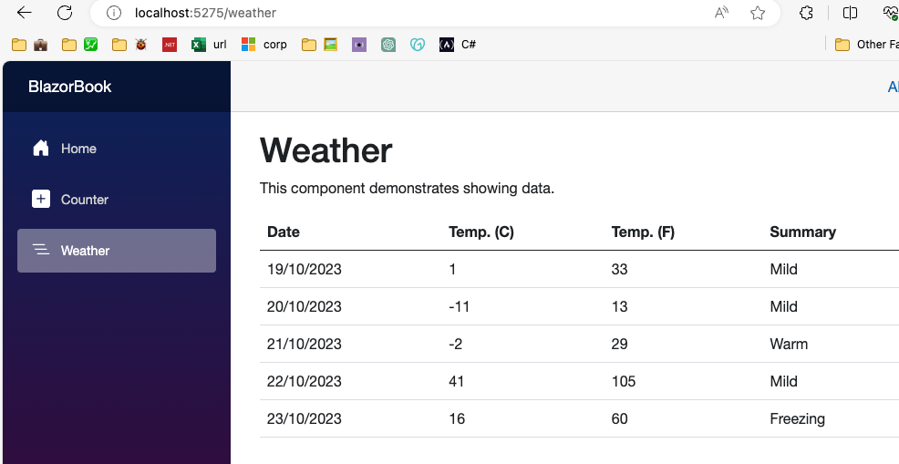
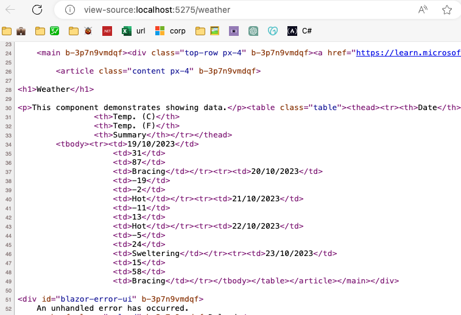
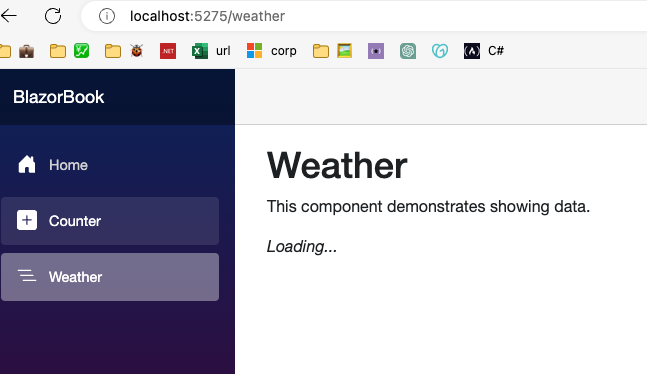
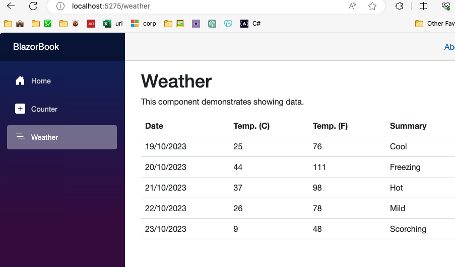
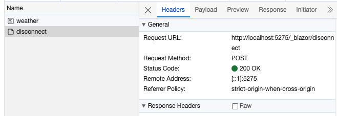
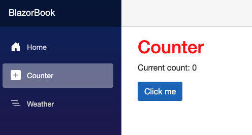
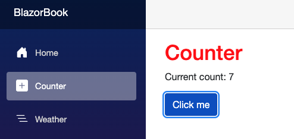
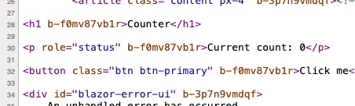
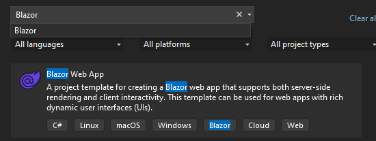

## 📗 eBook COMPLETO: Blazor com .NET 8
- [👉 Clique aqui para baixar seu eBook 👈](https://go.balta.io/ebook-blazor?utm_source=Website&utm_campaign=website-to-lp&utm_content=blog-post&utm_medium=article)

Render Modes é um novo conceito no Blazor (.NET 8+) que nos permite selecionar como e onde será a interatividade de um componente ou página.

## Blazor Render Modes

Se você me perguntasse sobre o Blazor há alguns anos atrás eu diria “Legal, mas ainda prefiro Angular”, simplesmente por que trocar um Framework consolidado como Angular por Blazor não me parecia uma boa ideia.

O tempo passou e o Blazor amadureceu, mas mesmo assim, minhas recomendação era “Se você já tem código em C#, Blazor é uma ótima opção”.

Isto por que mesmo trabalhando com modelo SPA, o Blazor, assim como Angular, React e Vue, não tem um bom suporte a SSR, que sustenta o SEO.

No caso do balta por exemplo, o Blazor seria incrível na sessão de compras, para trazer uma maior interatividade para o usuário.

Avançando para o Player (Área que o aluno assiste os cursos no site) o Blazor seria devastador, mas mesmo assim, todo nosso site é feito em Razor Pages.

Esta decisão é por que nossa aplicação é relativamente pequena, não há motivos para quebrá-la em três só para ter o Blazor na jogada (Pagamento e Player).

Os benefícios não justificavam o esforço e custo de manter três aplicações, e isto era um dos motivos pelos quais não movemos para o Blazor.

Acredito que muitos outros negócios também se seguraram nestas argumentações até agora, já que o jogo mudou completamente.

## O que são Render Modes

No Blazor 8 (.NET 8) foi incluso uma opção chamada Render Modes ou modo de renderização para componentes e páginas.

Esta opção permite definirmos o modelo de renderização de uma página ou componente (Na verdade por ser até para aplicação toda).

Particularmente, opto pela flexibilidade, então somente se fosse algo muito específico eu selecionaria apenas um Render Mode para aplicação toda.

Ao todo temos quatro modos de renderização, cada qual com suas particularidades, que afetam a forma como as páginas e componentes são desenhados.

- SSR e SSR Rendering
- Interactive Server
- Interactive WebAssembly
- Auto

## SSR

Já comentamos sobre o SSR ou Server Side Rendering, mas vamos entender na prática o que ele é, e como ele funciona.

### Como é o processo de SEO

SEO é a sigla para Search Engine Optimization e ele é um mundo a parte, existem livros só sobre o assunto, mas vamos resumir aqui.

Uma das validações que o Google faz para indexar nossas páginas e rankear elas em seu motor de busca é verificar o título de conteúdo da página.

Quando buscamos por “.NET” ele verifica as páginas que contém o título “.NET” e também analisa o corpo da página.

Esta última etapa é a mais complexa para nós, visto que se a página não possuir um corpo condizente com o título, você despenca no ranking.

Vale lembrar que no modelo WASM nós não temos a possibilidade de alterar o HTML gerado, já que ele é modificado no navegador.

Além disso, é importante frisar que os Render Modes são por componente (Ou página), então seja criativo, nem todo componente precisa ser SSR.

### Como usar SSR no Blazor

Lembra do tópico anterior onde trabalhamos no Counter e adicionamos um atributo nele chamado `@rendermode InteractiveServer`?

Se sua página ou componente não declara de forma explícita que ele é interativo, o Blazor automaticamente renderizará ele usando SSR.

Se tomarmos como base por exemplo a página Weather, que carrega dados de um serviço, nós podemos comentar o atributo `StreamRendering` ou passar o valor `false` como parâmetro.

```html
@* @attribute [StreamRendering(true)] *@

ou

@attribute [StreamRendering(false)]
```

Como resultado, teremos a página levando alguns segundos para carregar e depois exibindo os dados normalmente.



Porém, ao inspecionar a página, podemos ver que os dados estão lá, ou seja, caso eles fossem relevantes para o SEO, estaríamos bem.



O que acontece neste cenário é que toda a página é gerada no servidor, ou seja, HTML, CSS e JS, e depois enviado para renderização.

É o mesmo processo que o ASP.NET Razor Pages faz (Talvez seja hora de migrar o balta para Blazor 😅).

## SSR Streaming

O ***Streaming*** ou `Stream Rendering` executa um processo parecido, porém mais inteligente, trazendo a página em um primeiro momento e os dados depois.

Para utilizar o `StreamRendering` basta utilizar o atributo `StreamRendering(true)` conforme mostrado abaixo.

```html
@attribute [StreamRendering(true)]
```

Para conseguir visualizar o efeito do StreamRendering, recomendo que altere o atraso na recuperação de dados.

```csharp
// Linha 45
await Task.Delay(5000);
```

Esta página representa um uso extremamente comum em nosso dia-a-dia, onde precisamos ler dados do banco de dados ou de um serviço e exibir na tela.

O que fizemos acima foi simular uma “demora” na recuperação destes dados, que é outro cenário comum.

Ao executar a aplicação, navegando para página de clima, temos o conteúdo carregado, mas os dados não, exibindo um *“Loading”* enquanto os mesmos são recuperados.



A principal diferença entre o `StreamRendering` e o SSR é que no exemplo anterior (SSR) a página não era carregada enquanto os dados não estivessem completos.

Neste caso, assim que os dados chegam do banco ou serviço, eles automaticamente vão para a tela, atualizando o componente ou página.



Porém, se você precisa destas informações para uma melhor indexação da sua página (SEO), é melhor olhar o HTML antes.


Como podemos ver, dado que o conteúdo foi injetado depois que a página foi carregada, o HTML não foi modificado.

Desta forma, o HTML sempre irá renderizar o conteúdo inicial que ele teve, quando foi servido direto do servidor via SSR.

```html
<h1>Weather</h1>

<p>This component demonstrates showing data.</p><p><em>Loading...</em></p><!--/bl:13--></article></main></div>
```

### Como esta mágica acontece?

Sempre que o Blazor identifica um componente ou página com `StreamRendering` ele renderiza tudo o que pode, o que tem em mãos.

No caso da página `Weather`, como ele não tem todas as informações, ele renderiza a página e fica aguardando pelos dados adicionais.

Assim que estes dados chegam, ele atualiza a tela e isto é feito por que a tela se mantém conectada ao servidor através de um `Socket`.

Ao inspecionarmos a execução da página, podemos ver que após navegar para `Weather`, após o carregamento de todos os dados, temos um item `disconnect`.



Isto significa que mesmo após a página ter sido exibida na tela, ainda havia uma conexão ativa entre ela e o servidor, que foi fechada apenas momentos depois.

## Interactive Server

Enquanto o SSR e Stream Rendering são excelentes para exibir informações, ainda temos a necessidade de interação.

Sempre que precisamos dar vida aos componentes ou páginas, interagindo com botões, inputs, dentre outros itens, temos três opções, sendo a primeira o **Interactive Server**.

Neste formato, adicionamos o atributo `@rendermode InteractiveServer` ao componente ou página.

O comportamento é muito parecido com o do Stream Rendering, nosso componente irá renderizar mas ficará conectado ao servidor.



Desta forma, podemos processar nosso código no servidor, também utilizando Socket (SignalR) para manter a conexão aberta.



O componente responde rapidamente e se atualiza. Isto acontece quase que instantaneamente pois a conexão via Socket e a otimização na transferência de dados ajudam bastante.

Porém, assim como no Stream Rendering, como estamos modificando os elementos da tela após o HTML ser renderizado, o código da página não é alterado.



## Criando projetos no Visual Studio

Durante a escrita deste eBook a versão mais recente do .NET 8 é a RC 2 (Release Candidate), que embora esteja muito próxima da final, ainda pode variar.

Desta forma, para entender os próximos modos de renderização, criaremos o projeto por dentro do Visual Studio Preview 17.0.4 (Ou superior).

Acredito que na versão final teremos comandos do `dotnet new` para criação destes templates, dispensando uso do Visual Studio neste passo.

Por enquanto, vamos selecionar a opção ***File > New*** Project e buscar pelo template **Blazor Web App**.



Após selecionar o template, vamos nomear o projeto e selecionar uma localização para o mesmo, fique à vontade nesta etapa.


Movendo adiante, temos a tela que configura o tipo de interação que o projeto terá, que fica na opção **Interactivity Type**.

Além desta opção temos o Interactivity Location, que podemos definir como **Global** (Para todas as páginas e componentes) ou **Per Page/component** (Específico por página ou componente).


Neste momento vale ressaltar que o **Identity** também chegou ao Blazor, sendo possível configurar o tipo de autenticação como **None** ou **Individual Accounts**.


Por fim temos os tipos de interação que queremos, por enquanto vamos ignorar o **None** e **Server** que já vimos anteriormente e focar no **WebAssembly** e **Auto**.


Nos próximos tópicos tomaremos como base projetos criados com Interactivity Type Web Assembly e Auto respectivamente.

## Interactive WebAssembly

Mas se podemos rodar o .NET direto no navegador utilizando WebAssembly (WASM), por que utilizar o modo anterior?

Sempre que rodamos nosso código no servidor, temos a segurança da execução em um ambiente externo.

Por exemplo, não daria para deixar uma Connection String no WASM, visto que o código é executado no navegador, esta informação teria que ficar por lá.

Por outro lado, ficar conectado ao servidor (Modelo Interactive Server) demanda mais infraestrutura e pode ser mais lento.

Além de não depender do servidor, o WASM ainda tem o poder de usar mais a capacidade da máquina do cliente (Que provavelmente é mais rápida que o servidor).

### Inspecionando o projeto

Para iniciar um projeto com **Interactivity Type** em **WebAssembly**, basta selecionar a opção conforme imagem abaixo.


O primeiro ponto que podemos notar é que alterando o **Interactivity Typ**e para **WebAssembly** temos agora dois projetos sendo criados, um para o **Server** e outro para o **Client**.


Começando nossa análise pelo projeto do servidor (`BlazorApp1`), podemos notar que no `Program.cs` temos a adição do `AddInteractiveWebAssemblyComponents` desta vez.

Este item só pode ser adicionado em projetos com ***Interactivity Type*** atribuidos como **WebAssembly** ou **Auto**.

Em adicional, como o WebAssembly roda apenas no lado do cliente (Navegador), precisamos de um projeto (`BlazorApp1.Client`) dedicado para ele.

Continuando nossa análise, temos como resultado a adição do `AddInteractiveWebAssemblyComponents` e `AddInteractiveWebAssemblyRenderMode` no `Program.cs`.

```csharp
// ...
builder
    .Services
    .AddRazorComponents()
    .AddInteractiveWebAssemblyComponents();

// ...
app.MapRazorComponents<App>()
    .AddInteractiveWebAssemblyRenderMode()
    .AddAdditionalAssemblies(typeof(Counter).Assembly);
```

Para finalizar, temos a adição do `AddAdditionalAssemblies(typeof(Counter).Assembly)`, que nos diz onde encontrar componentes que forem do tipo **WebAssembly**.

Podemos notar também, que dentro do projeto `BlazorApp1`, na pasta `Component/Pages` não existe mais o component `Counter.razor`.


Esta mudança ocorre pois tratando-se de um projeto com suporte a **WebAssembly**, a fins de exemplo, o componente foi movido para o projeto `BlazorApp1.Client`.

Todos os componentes contidos neste projeto podem ser renderizados no formato **WebAssembly**, além da possibilidade de usar componentes no projeto **Server**.

Se analisarmos o `Program.cs` do projeto `BlazorApp1.Client`, podemos notar que esta é uma aplicação Web .NET extremamente simples.

```csharp
using Microsoft.AspNetCore.Components.WebAssembly.Hosting;

var builder = WebAssemblyHostBuilder.CreateDefault(args);

await builder.Build().RunAsync();
```

Por fim, expandindo a pasta `Pages`, podemos encontrar o componente `Counter.razor`, que nos exemplos anteriores estava junto aos outros componentes.


Fora esta mudança, o código do nosso componente se mantém o mesmo, com uma singela mudança no **Render Mode**.

```csharp
@page "/counter"
@rendermode InteractiveWebAssembly

<PageTitle>Counter</PageTitle>

<h1>Counter</h1>

<p role="status">Current count: @currentCount</p>

<button class="btn btn-primary" @onclick="IncrementCount">Click me</button>

@code {
    private int currentCount = 0;

    private void IncrementCount()
    {
        currentCount++;
    }
}
```

Desta vez, como podemos ver na segunda linha, utilizamos o atributo `RenderModeInteractiveWebAssembly` ao invés do `RenderModeInteractiveServer` como havíamos feito no passado.

### Executando o projeto

Algo que precisamos entender é que o projeto `BlazorApp1.Client` serve apenas como um local para armazenarmos nossas páginas e componentes que desejamos renderizar no formato **WebAssembly**.

Desta forma, vamos sempre executar o projeto `BlazorApp1`, que consequentemente carregará o projeto `BlazorApp1.Client` consigo.

O mesmo vale para a publicação do projeto, onde faremos sempre o deploy do `BlazorApp`, que é nossa aplicação e não do `BlazorApp1.Client`.


Como resultado da execução do projeto, temos o mesmo exemplo dos tópicos anteriores, porém, desta vez o componente `Counter.razor` está servido via **WebAssembly** (C# rodando no navegador).


Vale a pena ressaltar que a primeira vez que o componente é carregado, podemos experimentar uma leve lentidão, devido ao fato que o .NET estará sendo baixado no navegador, conforme explicamos anteriormente.

## Auto

Finalizando nosso entendimento sobre **Render Modes**, temos o **Auto**, que é uma mescla entre o **Server** e o **WebAssembly**.

Neste modo, as páginas ou componentes são servidas primariamente no modelo **Server**, visto que este é o modo mais rápido para exibir um componente.

Dizemos isto pois no **WASM** precisamos baixar o .NET e isto pode levar algum tempo, dependendo da conexão do usuário com a internet.

Após exibido o componente na tela, o Blazor iniciará automaticamente o download do ***.NET Runtime*** em segundo plano.

Nas próximas vezes que o usuário tentar renderizar este componente, o Blazor checará se o ***.NET Runtime*** já está presente na máquina.

Caso positivo, o componente então é renderizado utilizando **WebAssembly**, o que o torna mais performático após carregado.

Em resumo, no modo **Auto** nós temos o melhor dos dois mundos, com a agilidade na renderização inicial do componente e a performance posterior do **WASM**.

### Inspecionando o projeto

Para iniciar um projeto com o **Interactity Type** em **Auto**, basta selecionar a opção conforme imagem abaixo.


Como você já deve imaginar, neste projeto temos a soma dos exemplos anteriores, suportando Server e WASM juntos.


Sendo assim, novamente precisamos de dois projetos, um para o **Server** e outro para o **WASM**, e seguimos os mesmos padrões do exemplo anterior.

Porém, desta vez podemos notar o uso tanto do `AddInteractiveServerComponents` quanto do `AddInteractiveWebAssemblyComponents`.

```csharp
// ...

builder
    .Services
    .AddRazorComponents()
    .AddInteractiveServerComponents()
    .AddInteractiveWebAssemblyComponents();

// ...

app.MapRazorComponents<App>()
    .AddInteractiveServerRenderMode()
    .AddInteractiveWebAssemblyRenderMode()
    .AddAdditionalAssemblies(typeof(Counter).Assembly);
```

Da mesma forma, precisamos do `AddInteractiveServerRenderMode` e `AddInteractiveWebAssemblyRenderMode` para suportar os dois modos de renderização.

### Executando o projeto

A execução deste projeto se dará pelo projeto `BlazorAppAuto` e não pelo projeto `BlazorAppAuto.Client`, igual vimos no exemplo anterior.


Como resultado, temos um comportamento exatamente identico ao anterior, com a renderização do componente **Counter** na tela.


Porém, existe um sutil detalhe aqui, sendo que na primeira execução deste componente, o mesmo foi servidor no modo **Server**.

Enquanto o componente **Counter** era servido e o usuário navegava pelo aplicativo, o ***.NET Runtime*** foi baixado em segundo plano.

Agora, sempre que o usuário retornar ao componente **Counter**, o mesmo será renderizado no formato **WASM**, já que o ***.NET Runtime*** se encontra instalado no navegador.

Ao analisarmos o Counter.razor desta vez, temos o uso do `RenderModeInteractiveAuto` ao invés do `RenderModeInteractiveServer` ou `RenderModeInteractiveWebAssembly`.

```csharp
@page "/counter"
@rendermode InteractiveInteractiveAuto

<PageTitle>Counter</PageTitle>

<h1>Counter</h1>

<p role="status">Current count: @currentCount</p>

<button class="btn btn-primary" @onclick="IncrementCount">Click me</button>

@code {
    private int currentCount = 0;

    private void IncrementCount()
    {
        currentCount++;
    }
}
```

Em resumo, temos basicamente o mesmo código para todos os modos de renderização, porém eles tem um comportamento bem diferente por baixo dos panos.