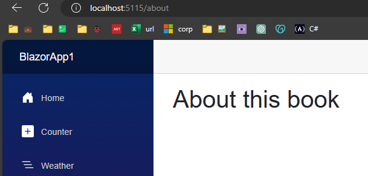

## 📗 eBook COMPLETO: Blazor com .NET 8
- [👉 Clique aqui para baixar seu eBook 👈](https://go.balta.io/ebook-blazor?utm_source=Website&utm_campaign=website-to-lp&utm_content=blog-post&utm_medium=article)

O Blazor trabalha de forma extremamente simples com rotas e navegação, e se você já aprendeu um pouco sobre isto no **[curso gratuito de Razor Pages](https://balta.io/cursos/uma-visao-geral-do-aspnet-razor-pages)**, estará mais do que em casa aqui.

Isto por que dado um atributo `@page` em um arquivo `.razor`, o mesmo se torna automaticamente uma rota.

Inclusive, precisamos nos policiar para não termos rotas iguais, desta forma, recomendo que estruture bem as pastas e organize bem seu projeto.

> **⚠️ IMPORTANTE**
Você não precisa seguir a estrutura de exemplo dos projetos Blazor, você pode criar as suas, inclusive recomendo que utilize a separação por funcionalidades ou áreas ao invés de ter uma única pasta para páginas e componentes.
> 

## Rotas

Indo direto ao ponto, sempre que definimos um atributo `@page` temos uma rota, que deve ser no formato `string` e começar com `“/”`.

```csharp
@page "/counter"
// https://localhost:xxxx/counter
```

Desta forma, se criarmos um arquivo chamado `About.razor` na pasta `Components/Pages` com o seguinte conteúdo:

```csharp
@page "/about"

<h1>About this book</h1>
```

Teremos como resultado o seguinte conteúdo sendo exibido, sempre que navegarmos para URL `https://localhost:xxxx/about`.



Da mesma forma, podemos alterar a URL para ter mais segmentos, e continuar com um resulta similar.

```csharp
@page "/about/this-book"

<h1>About this book</h1>
```

Isto ocorre por que o uso de “/” e “-” na URL é plenamente permitido, então a renderização da página segue normalmente.


Por fim, pouco importa onde sua página está, se houver o atributo @page no começo do seu arquivo, ele será adicionado as rotas.


Desta forma, temos um arquivo `Manage.razor` em uma subpasta, dentro de outra subpasta, que contém o atributo `@page` como mostrado abaixo.

```csharp
@page "/admin/account/manage"

<h1>Manage Your Account</h1>
```

E como resultado, temos a página sendo renderizada normalmente, visto que não faz diferença em qual pasta ela está alocada.


> **💡 DICA**
Você não precisa seguir a mesma conveção das pastas no nome da URL. No exemplo acima, embora o arquivo `Manage.razor` esteja na pasta `Admin/Account`, sua URL não necessariamente precisa seguir este padrão, embora seja recomendado.
> 

## Links

O Blazor possui duas formas de criar links para páginas, o tradicional `href` do HTML e o `NavLink`, componente exclusivo do Blazor.

Em ambos os casos devemos referenciar o caminho (URL) até a nossa página, que no exemplo é a `Counter.razor`.

```html
<a class="nav-link" href="/counter">
    Counter (Href)
</a>
```

Da mesma forma, podemos utilizar o `NavLink`, que é o componente de navegação padrão do Blazor e nos fornece alguns recursos adicionais.

```html
<NavLink class="nav-link" href="counter">
    Counter (NavLink)
</NavLink>
```

### NavLink

A maior diferença é que o `NavLink` verifica a rota que estamos e tem a possibilidade de adicionar alguma classe do CSS ao elemento em questão.

No caso, o `NavLink` tem a possibilidade de alternar uma classe CSS do elemento utilizando os atributos `Match` e `ActiveClass`.

Caso o atributo `ActiveClass` não seja definido, o `NavLink` por padrão atribuirá uma classe chamada `active` do CSS ao elemento.

```html
<NavLink class="nav-link" href="" Match="NavLinkMatch.All">
   Home
</NavLink>
```

Note que no `href` a “/” não está presente, isto por que estamos utilizando um template de rotas e ela se torna opcional.

### Match

O atributor `Match` é um ***enumerador*** que possui dois valores, sendo eles `All` e `Prefix`, ambos utilizados para verificar a URL atual.

O `NavLinkMatch.All` define que a URL completa deve bater com o valor do `href` para que a classe `active` (Ou valor do `ActiveClass`) seja atribuído ao elemento.

Já o `NavLinkMatch.Prefix` define que a classe `active` (Ou valor do `ActiveClass`) deve ser aplicado quando o prefixo da URL bate com o valor `href` do elemento.

```html
<li>
    <NavLink href="/pedidos"  Match="NavLinkMatch.Prefix">
        Pedidos
    </NavLink>
</li>
<li>
    <NavLink href="/pedidos/detalhes"  Match="NavLinkMatch.All">
        Detalhes do Pedido
    </NavLink>
</li>
<li>
    <NavLink href="/pedidos/editar"  Match="NavLinkMatch.All">
            Editar Pedido
    </NavLink>
</li>
```

No exemplo acima, quando o usuário navega para `/pedidos`, apenas o primeiro link fica ativo. 

Quando o usuário navega para `/pedidos/detalhes`, o primeiro link permanece ativo, pois ainda corresponde ao prefixo da URL, e o segundo link também fica ativo porque corresponde a toda a URL.

Os valores dos parâmetros de rota são considerados para fins de correspondência de URLs, mas os valores e fragmentos da string de consulta são ignorados.

### ActiveClass

O atributo `ActiveClass` permite adicionar uma classe (CSS) ao `NavLink`. Por padrão, uma classe chamada `active` é adicionada.

Para alterar esse valor padrão, basta informar o nome da classe (CSS) que deseja atribuir ao `NavLink` quando o `Match` for identificado.

```html
<NavLink href="/pedidos"  Match="NavLinkMatch.Prefix">
    Pedidos
</NavLink>
```

No exemplo acima, como nenhum valor foi atribuído ao `ActiveClass`, uma classe chamada `active` será atribuída assim que navegarmos para `/pedidos`.

```html
<NavLink href="/pedidos" ActiveClass="link-ativo" Match="NavLinkMatch.Prefix">
    Pedidos
</NavLink>
```

Já neste outro exemplo, como um valor foi atribuído ao `ActiveClass`, assim que navegarmos para `/pedidos` uma classe chamada `link-ativo` será adicionada ao `NavLink`.

## NavigationManager

Para realizar a navegação através de um código C#, podemos utilizar o `NavigationManage`, injetando ele na página.

```html
@page "/"
@inject NavigationManager navigationManager
<button @onlick="Navigate">Click</button>
@code{
    void Navigate()
    {
        navigationManager.NavigateTo("/other");
    }
}
```

Para realizar a navegação podemos utilizar algum dos métodos presentes no `NavigationManager`, como o `NavigateTo` e especificar uma URL.

## FocusOnNavigate

Outro elemento que podemos encontrar é o `FocusOnNavigate`, presente no arquivo `Routes.razor` e que nos auxilia na seleção de elementos.

```csharp
<Router AppAssembly="@typeof(Program).Assembly">
    <Found Context="routeData">
        <RouteView RouteData="@routeData" DefaultLayout="@typeof(Layout.MainLayout)" />
        <FocusOnNavigate RouteData="@routeData" Selector="h1" />
    </Found>
</Router>
```

No exemplo acima, definimos que sempre após navegar para uma rota (Desde que ela exista), iremos selecionar o primeiro `H1` (Headline) assim que a página for carregada.

Este comportamento nos ajuda na questão de usabilidade e acessibilidade, tornando mais fácil a navegação sem mouse ou simplesmente a rolagem da tela para uma sessão importante após a navegação.

## Rotas em diferentes projetos

É possível ter componentes e páginas em projetos distintos, seja por motivo de reuso ou simplesmente uma organização do seu projeto.

Neste caso, podemos utilizar o `AdditionalAssemblies` para especificar projetos (Assemblies) adicionais ao atual.

```html
<Router
    AppAssembly="@typeof(App).Assembly"
    AdditionalAssemblies="new[] { typeof(Component1).Assembly }">
    @* ... Router component elements ... *@
</Router>
```

Neste caso, o Blazor também buscará páginas em outros projetos especificados nesta propriedade.

## Parâmetros de Rotas

Uma ação muito comum que temos é a passagem de parâmetros através das rotas durante a navegação.

No Blazor, assim como no Razor Pages, os parâmetros podem ser especificados através das chaves na URL.

```csharp
@page "/route-parameter-1/{text}"
```

Posteriormente podemos atribuir (Binding) um parâmetro a uma propriedade simplesmente usando o atributo `Parameter` para decorá-la.

```csharp
@code {
    [Parameter]
    public string? Text { get; set; }
}
```

É importante frisar que o atributo `Parameter` só pode ser vinculado a propriedades. Variáveis não irão funcionar neste caso.

Em adicional, é importante manter o mesmo nome entre a propriedade e parâmetro para uma transição sem atritos. O exemplo final fica assim:

```csharp
@page "/route-parameter-1/{text}"

<h1>Blazor is @Text!</h1>

@code {
    [Parameter]
    public string? Text { get; set; }
}
```

Desta forma, ao chamarmos a URL `https://localhost:xxxx/route-parameter-1/awesome` teríamos o texto ***”Blazor is awesome”*** escrito na tela.

Em contrapartida, ao tentar acessar a mesma URL anterior sem informar um parâmetro (`https://localhost:xxxx/route-parameter-1`), teríamos um erro **404**, de página não encontrada.

### Parâmetros opcionais

Como vimos no exemplo anterior, assim que declaramos um parâmetro em uma rota, ele se torna parte dela.

Desta forma, caso o parâmetro não seja informado, a rota se torna incompleta, sendo impossível acessá-la.

Assim como no C# temos os [**Nullable Types**](https://go.balta.io/ebook-nullable-types-dotnet?utm_source=eBook&utm_campaign=ebook-blazor&utm_content=ebook-blazor&utm_medium=referencia-texto), aqui temos os parâmetros opcionais, onde podemos definir sua obrigatoriedade utilizando um `?`.

```csharp
@page "/route-parameter-1/{text?}"
```

Adicionando o ? ao fim do parâmetro, ele será declarado como `Nullable`, ou seja, se tornará opcional, tornando a URL `https://localhost:xxxx/route-parameter-1` válida.

Vale lembrar que a URL `https://localhost:xxxx/route-parameter-1/awesome` também continua válida, visto que ela informa um parâmetro.

Para receber este parâmetro, é importante declarar a propriedade como `Nullable` também, já que o valor pode vir nulo e causar um ***NullReferenceException***.

```csharp
...
@code {
    [Parameter]
    public string? Text { get; set; }
}
```

Por fim, podemos fazer uso do método `OnInitialized` que é executado sempre que o componente é renderizado na tela.

Neste método podemos aproveitar para iniciarlizar nossa propriedade com algum valor caso nenhum parâmetro seja fornecido.

```csharp
protected override void OnParametersSet()
{
    Text = Text ?? "awesome";
}
```

O código final do nosso componente fica conforme mostrado abaixo:

```csharp
@page "/route-parameter-1/{text?}"

<h1>Blazor is @Text!</h1>

@code {
    [Parameter]
    public string? Text { get; set; }

    protected override void OnInitialized()
    {
        Text = Text ?? "fantastic";
    }
}
```

### Restrições de parâmetros

Além de especificar um parâmetro, podemos limitar seu tipo e adicionar algumas restrições a ele, facilitando ainda mais a validação.

Com as restrições de rotas, além de informar o parâmetro, caso o mesmo contenha alguma restrição, também será retornar o erro 404.

Para adicionar uma restrição ao parâmetro, basta especificar um tipo (Veja tabela adiante) após o uso do separador `:`.

```csharp
@page "/user/{Id:int}"
```

Desta forma, se tentarmos abrir a URL `/user/test`, teríamos um erro **404**, pois embora fora informado um parâmetro para o `Id`, o mesmo não é do tipo ***inteiro*** (Informamos `test`, uma ***string***).

Abaixo encontra-se uma tabela com todas as restrições disponíveis e alguns exemplos de uso das mesmas.

| Restrição | Exemplo | Validação | Cultura invariante |
| --- | --- | --- | --- |
| bool | {active:bool} | true, FALSE | No |
| datetime | {dob:datetime} | 2016-12-31, 2016-12-31 7:32pm | Yes |
| decimal | {price:decimal} | 49.99, -1,000.01 | Yes |
| double | {weight:double} | 1.234, -1,001.01e8 | Yes |
| float | {weight:float} | 1.234, -1,001.01e8 | Yes |
| guid | {id:guid} | CD2C1638-1638-72D5-1638-DEADBEEF1638, {CD2C1638-1638-72D5-1638-DEADBEEF1638} | No |
| int | {id:int} | 123456789, -123456789 | Yes |
| long | {ticks:long} | 123456789, -123456789 | Yes |

### Restrições e parâmetros opcionais

É possível utilizar restrições de parâmetros e parâmetros opcionais juntos, só devemos nos atentar a ordem das sinalizações.

Neste caso, o sinalizador de parâmetro opcional (`?`) vem sempre no fim da rota, enquanto o sinalizador de restrição (`:`) permanece no mesmo local anterior.

```csharp
@page "/user/{Id:int}/{Option:bool?}"
```

### Catch All

Além dos parâmetros convencionais, existe o chamado **Wildcard** ou **Coringa**, que é representado por um asterisco (`*`).

Quando utilizamos o `*`, ignoramos todos os parâmetros e passamos a assumir apenas a URL atual.

```csharp
@page "/catch-all/{*pageRoute}"

@code {
    [Parameter]
    public string? PageRoute { get; set; }
}
```

Desta forma, se chamássemos a URL `/catch-all/this/is/a/test`, todos os segmentos depois de `catch-all` seriam ignorados e o resultado da propriedade `PageRoute` seria `this/is/a/test`.

Este é um cenário para situações onde você quer ter uma segmentação na URL por conta de SEO mas quer manter uma mesma rota para um segmento todo.

## Query Strings

Você com certeza já acessou algum site que na URL havia um `?chave=valor`. Esta combinação é conhecida como **Query String**.

Desta forma, podemos passar parâmetros para nossas páginas que não afetam suas rotas, mas sim complementam a URL.

Por exemplo, podemos chamar a URL `https://balta.io/busca?termo=SQL` para informar um termo de busca via **Query String**.

```csharp
// https://balta.io/busca/termo
//                       👆 -> Parâmetro via URL

// https://balta.io/busca?termo=SQL
//                       👆 -> Parâmetro via Query String
```

Diferente dos parâmetros de rota, quando utilizamos Query String, nossas rotas não precisam de nada especial.

```csharp
@page "/busca"
```

Em adicional, precisamos do atributo `SupplyParameterFromQuery`, além do atributo `Parameter` que já vimos anteriormente.

```csharp
@code {
    [Parameter]
    [SupplyParameterFromQuery]
    public string? Term { get; set; }
}
```

Desta forma, dizemos que estamos recebendo um parâmetro chamado `Term` e que este será recebido via **Query String**.

Agora ao chamar a URL `https://balta.io/busca?termo=SQL` teremos como resultado o texto `Termo: SQL` sendo exibido na tela.

O código completo desta página fica conforme exibido abaixo:

```csharp
@page "/busca"

<h1>Exemplo de Busca</h1>

<p>Termo: @Term</p>

@code {
    [Parameter]
    [SupplyParameterFromQuery]
    public string? Term { get; set; }
}
```