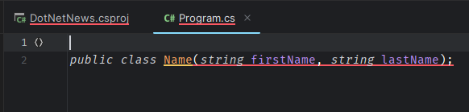

Nas últimas semanas tivemos o lançamento do Preview 3 do .NET 8 que sai em Novembro de 2023, juntamente com as primeiras novidades do C# 12. Vamos testar isso tudo?

## Como instalar o .NET 8

Você pode fazer o download do .NET 8 no site oficial da Microsoft, utilizando a URL abaixo.

🔗 [https://dotnet.microsoft.com/en-us/download/dotnet/8.0](https://dotnet.microsoft.com/en-us/download/dotnet/8.0)

Como o C# é uma linguagem gerenciada, e no caso, gerenciada pelo .NET, sua versão acompanha o Framework.

Desta forma, para utilizar o C# 12, você precisa do .NET 8, para usar o C# 11 precisa do .NET 7, o 10 do 6 e assim por diante.

# Language Preview

É importante salientar que este recuso está disponível no .NET 8 Preview 3, ou seja é apenas uma pré-visualização do que poderá ser este recurso.

Já vimos casos no passado, como o !! que foram removidos da versão final, então não se apegue muito aos novos recursos em sí até a versão final.

É importante frisar também que o .NET 8 só sai em Novembro de 2023, muita coisa pode mudar até lá e você precisa instalar a versão Preview 3 ou superior para testar estas funcionalidades.

O Language Preview é uma configuração contida no CSPROJ que diz qual versão do C# será usado no projeto.

Podemos utilizar este recurso tanto para aumentar como diminuir as versões da linguagem, sempre respeitando o Framework em pauta.

Se você está usando .NET 6 por exemplo, pode usar o C# 10 ou inferior, mas nunca superior.

Por fim, é importante entender que o C# também é distribuído em diferentes versões e somente ter o .NET 8 como Target Framework não significa que estamos usando a última versão.

É preciso de uma configuração adicional como veremos aqui neste artigo.

## Verificando a versão instalada

Com o .NET instalado, basta fechar seus terminais e abrir novamente, seguido pela execução do comando abaixo para verificar a versão instalada.

```bash
dotnet --version
## 8.0.100-preview.3.23178.7
```

Além disso, o .NET 8 ainda mantém o C# 11 como linguagem padrão, então é preciso habilitar uma funcionalidade chamada **Language Preview** no arquivo `.csproj` do seu projeto.

## Habilitando o Language Preview

Isto é feito pela configuração chamada **LangVersion** cujo temos que atribuir o valor `preview`, como mostrado abaixo.

```xml
<Project Sdk="Microsoft.NET.Sdk">

  <PropertyGroup>
    <OutputType>Exe</OutputType>
    <TargetFramework>net8.0</TargetFramework> 👈 Garantir que o .NET está na V8
    <ImplicitUsings>enable</ImplicitUsings>
    <Nullable>enable</Nullable>
    <LangVersion>preview</LangVersion> 👈 Adiciona esta linha
  </PropertyGroup>

</Project>
```

Além disso, provavelmente sua IDE não vai reconhecer os comandos novos, identificando eles como possíveis erros.



Mas o Build não mente, e como podemos ver, mesmo com a IDE informando que a sintacxe não é válida, nosso programa compila corretamente.

# Conclusão

Trocar de versão de linguagem e Framework no .NET é um trabalho relativamente simples, só precisamos nos atentar em relação as Breaking Changes e funcionalidades específicas de cada versão.
