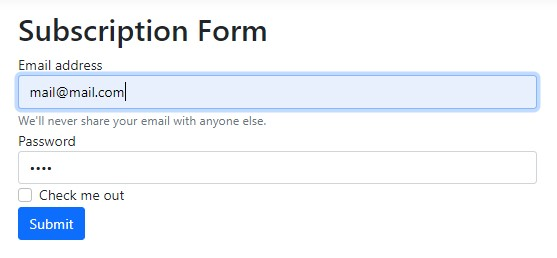
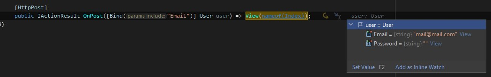
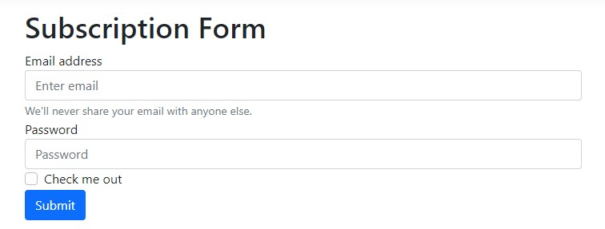

# Sumário
 
 1. [Introdução](#introducao)
 2. [Continue lendo](#continue-lendo)
 3. [Referências](#ref)


<div id='introducao'></div> 

# Introdução

Nossas aplicações web (sejam elas MVC, Razor Pages, WebAPI e etc) transportam dados através do protocolo HTTP.

O ModelBinding recupera os dados, fornece para nossas aplicações através de controladores ou páginas Razor por exemplo e converte cadeias de caracteres para tipos do .NET

Este artigo tem o objetivo de introduzir às possíveis formas de manipular informações utilizando o ModelBinding.

# Obtendo propriedades especificas

É possível que durante o processo de desenvolvimento surja situações onde seja necessário obter valores de propriedades especificas e ignorar outras. Para isto utilizamos o `[Bind]`. Assim ignorando propriedades não especificadas.

Ao preenchendo o formulário:



 ou enviar estes dados através de uma URL com QueryString:

```
https://localhost:7230/Subscription/OnPost/?Email=mail@mail.com&Password=123
```

Podemos recuperar 

Código:
```csharp
[HttpPost]
public IActionResult OnPost([Bind("Email")] User user) => View(nameof(Index));
```

 e depurando em seguida é possível observar que apenas o valor de `Email` foi obtido.

Depurando:


`Nota 1:` O `[Bind]` atribui valor padrão (se não informado um padrão será atribuido o valor nulo) para as propriedades não especificadas. Este comportamento faz com que ele não seja uma boa opção em casos de edição já que ele não mantém o valor anterior das propriedades não especificadas.


<!--  -->

# Obtendo valores da cadeia de caracteres de consulta

Antes de obter os valores a partir de uma cadeia de caracteres de consulta vamos deixar claro o que ela é. A cadeia de caracteres de consulta ou `QueryString` é um modelo para atribuição de valores a parâmetros utilizando a URL (Uniform resource locator).

```link
https://localhost:porta/Subscription/OnPost/?Email=mail@mail.com
```

# Obtendo valores de dados de rota

# Obtendo valores de campos de formulário postados

# Obtendo valores do corpo da solicitação

# Obtendo valores de cabeçalhos HTTP

# Validando a conversão de dados

# Continue lendo:

[ASP.NET Configuration Manager](https://balta.io/blog/aspnet-configuration-manager)

[ASP.NET Minimal APIs](https://balta.io/blog/aspnet-minimal-apis)

[ASP.NET Minimal SignalR](https://balta.io/blog/aspnet-minimal-signalr)

## Cursos relacionados

`Gratuito` | [Fundamentos do C#](https://balta.io/cursos/fundamentos-csharp)

[Fundamentos do ASP.NET 6](https://balta.io/cursos/fundamentos-aspnet)

<div id='ref'></div> 

## Referências
[Documentação da Microsoft](https://docs.microsoft.com/en-us/aspnet/core/mvc/models/model-binding?view=aspnetcore-6.0)