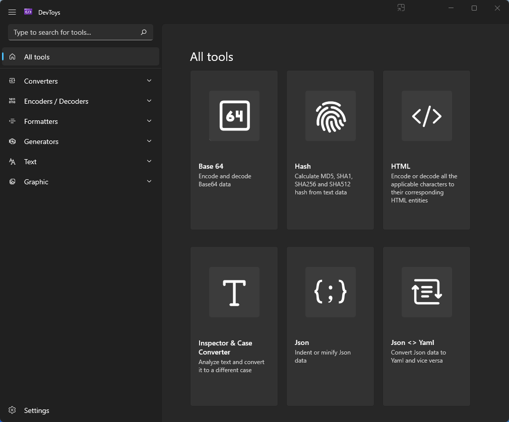

**Um aplicativo offline do Windows que ajuda os desenvolvedores nas tarefas diárias**

Gratuito, de código aberto e offline
DevToys funciona totalmente offline! Não há necessidade de usar muitos sites falsos para fazer tarefas simples com seus dados.

_Mais de 24 ferramentas estão disponíveis, incluindo:_

Conversor de Json para Yaml e Yaml para Json
Conversor de texto e imagem Base64
Decodificador JWT
Comparador de texto
Gerador de hash
e mais estão chegando!

O **DevToys** foi projetado para abraçar o ecossistema do **_Windows._**

Sobreposição compacta também conhecida. Modo de imagem em imagem
Fixar ferramentas no Menu Iniciar
Pesquisa de ferramenta
Realce de sintaxe
Várias instâncias
Tema escuro/claro
IU moderna e responsiva
Desenvolvido e mantido por _Etienne Baudoux_ e _Benjamin Titeux._

Link para download:
https://apps.microsoft.com/store/detail/devtoys/9PGCV4V3BK4W?hl=pt-br&gl=BR

GitHub:
https://github.com/veler/DevToys

Fonte: https://devtoys.app/
