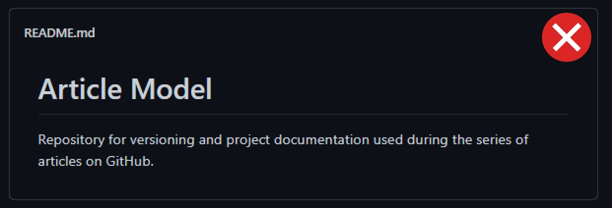
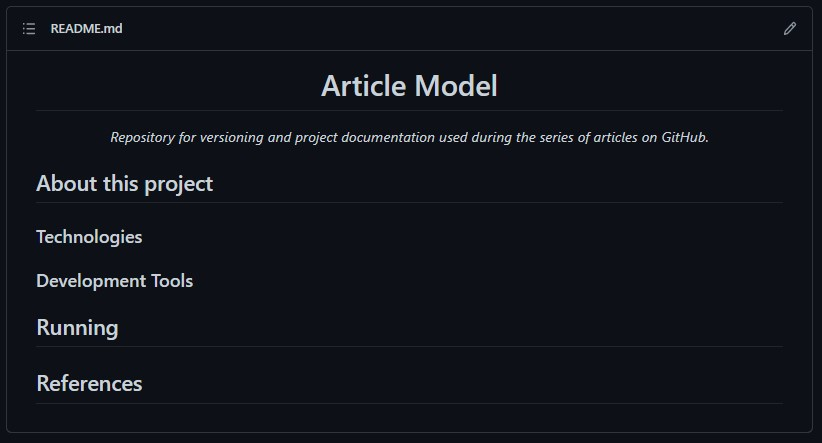
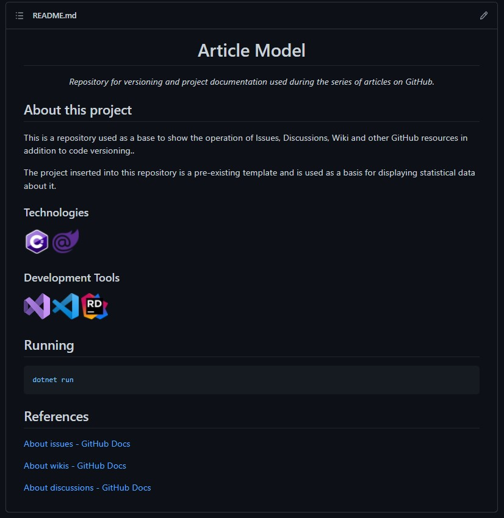
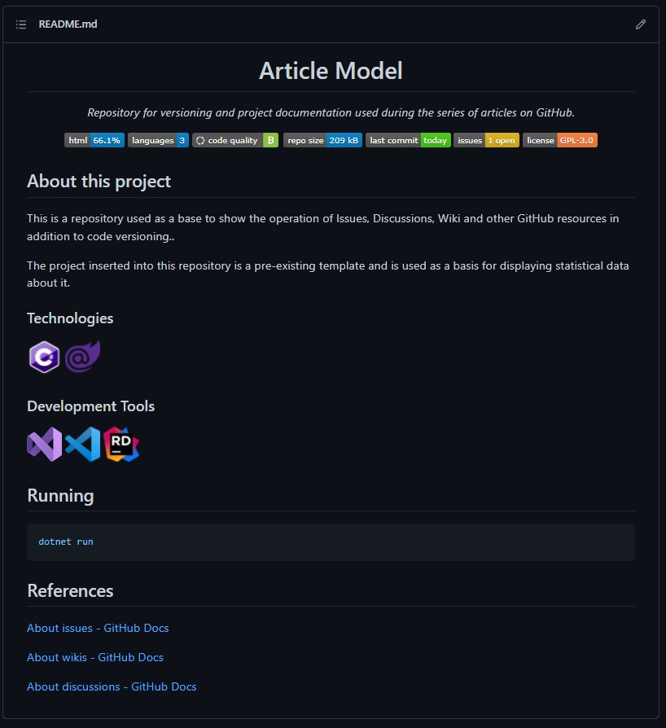

# Sumário

 1. [Introdução](#introducao)

Comentar exageradamente o código ou escrever documentação em arquivos Word é uma prática bem comum na rotina de trabalho de muitas pessoas desenvolvedoras. Aprenderemos neste artigo reforçaremos o que já foi mostrado nos artigos anteriores desta série: o GitHub é além de uma ferramenta de versionamento de código, uma ferramenta de DevOps também e este argumento se aplica neste artigo através da documentação.

A forma mais direta de apresentar um resumo e descrição do repositório é através do `README.md` o tão conhecido arquivo é muitas vezes mal produzido se não, ignorado. Este não deve ser menosprezado e sim visto como a oportunidade de fazer uma boa apresentação do conteúdo do repositório.

O README.md é muito eficiente mas os recursos de documentação do GitHub vão muito além dele oferecendo uma WiKi (Coleção de documentos) que podem ser escritos e formatados através do formato MarkDown. Também é possível gerar discussões sobre tarefas, desafios, sugestões de novas funcionalidades e diversos outros assuntos que seja do interesse dos administradores do repositório. Tudo exibido de forma organizada e bem segmentada.

# O README do repositório

O README.md como dito no parágrafo anterior é a primeira impressão do seu projeto e é sempre bom lembrar que *"A primeira impressão é a que fica"* apesar desta afirmação não ser absoluta verdade é melhor trabalhar para causar uma boa impressão.

`Nota 1:` Usaremos o mesmo repositório usado nos artigos anteriores desta série para seguir o conceito de continuidade.

## Como não fazer um README

Por padrão o README vem apenas com o título do projeto e é possível ver em maior parte dos projetos que as pessoas inserem apenas um parágrafo descrevendo o projeto. É preciso entender que outros desenvolvedores (que podem ou não ser iniciantes) e até recrutadores vão vir até o repositório e este arquivo pode fazer toda a diferença para eles.

Exemplo de como não deixar o README do seu projeto:


Código:
```markdown
# Article Model

Repository for versioning and project documentation used during the series of articles on GitHub.
```

## Um bom README

O que pode ser feito para tornar a apresentação efetiva é adicionar informações. Primeiro vamos centralizar o título, transformar a frase anterior em subtítulo e adicionar os tópicos que pretendemos apresentar:



Código:
```markdown
<h1 align="center">Article Model</h1>
<p align="center"><i>Repository for versioning and project documentation used during the series of articles on GitHub.</i></p>
```

Logo depois adicionamos o conteúdo dos tópicos lembrando sempre de formatar corretamente trechos de códigos de exemplo, links e imagens. Ficando desta forma:



Código:
```markdown
<h1 align="center">Article Model</h1>
<p align="center"><i>Repository for versioning and project documentation used during the series of articles on GitHub.</i></p>

Para finalizar o nosso README podemos adicionar estatísticas sobre o repositório como Linguagem mais utilizada, Número de linguagens presentes, qualidade do código e muitas outras através da ferramenta oferecida pela Codacy. Não abordaremos aqui como cadastrar seu repositório e ter acesso a estas estatísticas já que no site deles já tem uma documentação completa sobre isto. Veja como fica:



##  About this project

This is a repository used as a base to show the operation of Issues, Discussions, Wiki and other GitHub resources in addition to code versioning..

The project inserted into this repository is a pre-existing template and is used as a basis for displaying statistical data about it.

### Technologies
<p display="inline-block">
  
  
</p>
                                                                                                  
### Development Tools

<p display="inline-block">
  
  
  
</p>

## Running
dotnet run

## References
[About issues - GitHub Docs](https://docs.github.com/en/issues/tracking-your-work-with-issues/about-issues)

[About wikis - GitHub Docs](https://docs.github.com/en/communities/documenting-your-project-with-wikis/about-wikis)

[About discussions - GitHub Docs](https://docs.github.com/en/discussions/collaborating-with-your-community-using-discussions/about-discussions)

```

Para finalizar o nosso README podemos adicionar estatísticas sobre o repositório como Linguagem mais utilizada, Número de linguagens presentes, qualidade do código e muitas outras através da ferramenta oferecida pela Codacy. Não abordaremos aqui como cadastrar seu repositório e ter acesso a estas estatísticas já que no site deles já tem uma documentação completa sobre isto. Veja como fica:


O trecho de código adicionado abaixo do subtítulo:
```markdown
<p align="center" display="inline-block">
  
  
  <a href="https://www.codacy.com/gh/Editora-Artigos/article-model/dashboard?utm_source=github.com&amp;utm_medium=referral&amp;utm_content=Editora-Artigos/article-model&amp;utm_campaign=Badge_Grade"></a>
  
  <a href="https://github.com/Editora-Artigos/article-model/commits/master">
    
  </a>

  <a href="https://github.com/Editora-Artigos/article-model">
    
  </a>

  
  </p>
</p>
```

# Wiki

# Discus

# Continue lendo:

[Gestão de projetos com GitHub](https://balta.io/blog/gestao-de-projetos-com-github)

[ASP.NET Deploy com GitHub Actions e Microsoft Azurel](https://balta.io/blog/aspnet-deploy-github-actions-azure)

[GitHub Packages e GitHub Actions - Distribuindo contextos delimitados](https://balta.io/blog/github-packages-github-actions-distribuindo-contextos-delimitados)

## Cursos relacionados

`Gratuito` | [Fundamentos do Git e Azure DevOps](https://balta.io/cursos/fundamentos-git-azure-devops)

<div id='ref'></div> 

## Referências
[Documentação do GitHub](https://docs.github.com/)