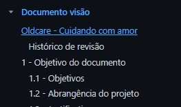
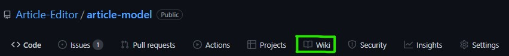
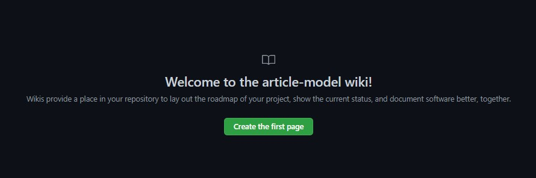
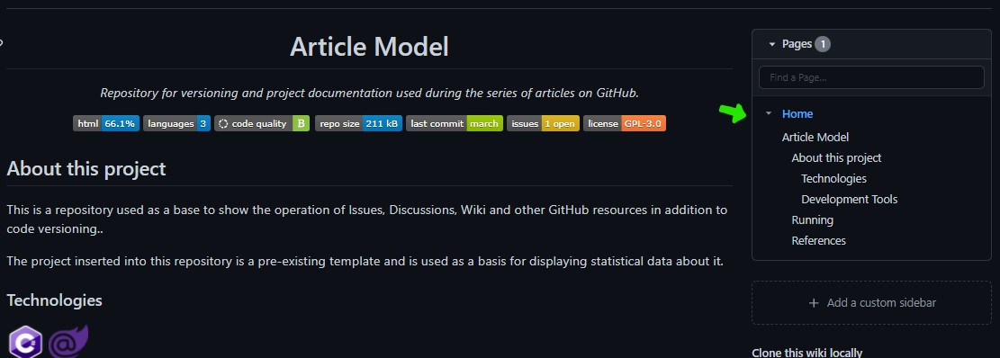
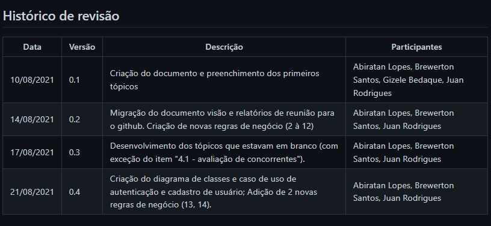
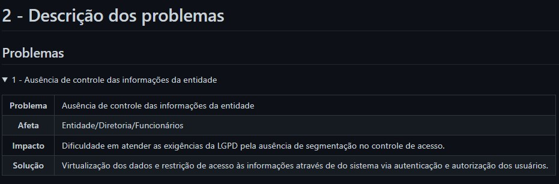
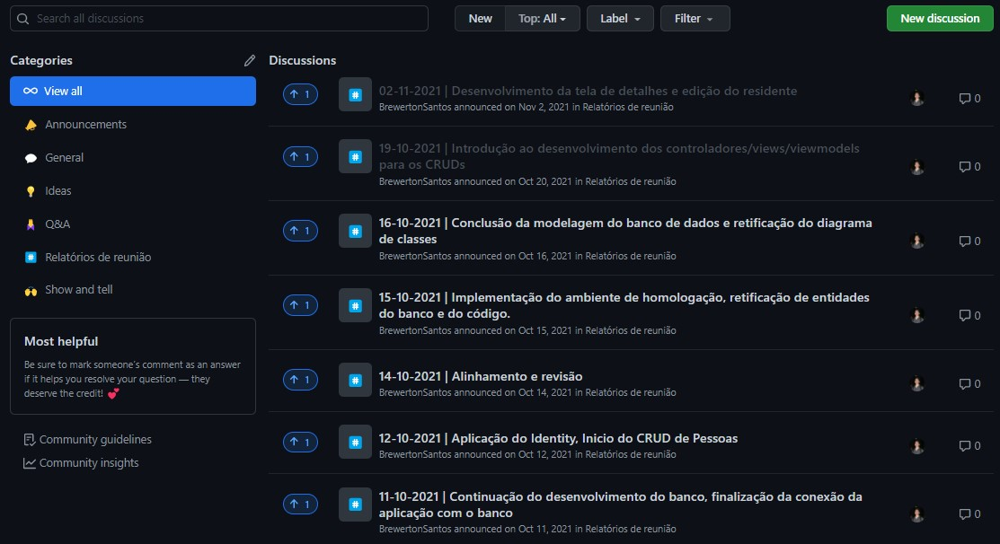
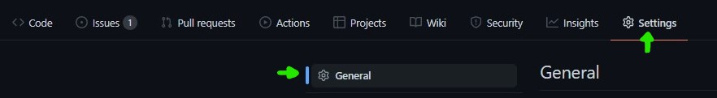

# Sumário

 1. [Introdução](#introducao)
 2. [O README do repositório](#o-readme-do-repositorio)
 3. [Wiki](#wiki)
 4. [Discussions](#discussions)
 5. [Continue lendo](#continue-lendo)
 6. [Referências](#ref)

<div id="introducao"></div>

# Introdução

Comentar exageradamente o código ou escrever documentação em arquivos Word é uma prática bem comum na rotina de trabalho de muitas pessoas desenvolvedoras. Aprenderemos neste artigo reforçaremos o que já foi mostrado nos artigos anteriores desta série: o GitHub é além de uma ferramenta de versionamento de código, uma ferramenta de DevOps também e este argumento se aplica neste artigo através da documentação.

A forma mais direta de apresentar um resumo e descrição do repositório é através do `README.md` o tão conhecido arquivo é muitas vezes mal produzido se não, ignorado. Este não deve ser menosprezado e sim visto como a oportunidade de fazer uma boa apresentação do conteúdo do repositório.

O README.md é muito eficiente mas os recursos de documentação do GitHub vão muito além dele oferecendo uma WiKi (Coleção de documentos) que podem ser escritos e formatados através do formato MarkDown. Também é possível gerar discussões sobre tarefas, desafios, sugestões de novas funcionalidades e diversos outros assuntos que seja do interesse dos administradores do repositório. Tudo exibido de forma organizada e bem segmentada.

<div id="o-readme-do-repositorio"></div>

# O README do repositório

O README.md como dito no parágrafo anterior é a primeira impressão do seu projeto e é sempre bom lembrar que *"A primeira impressão é a que fica"* apesar desta afirmação não ser absoluta verdade é melhor trabalhar para causar uma boa impressão.

`Nota 1:` Usaremos o mesmo repositório usado nos artigos anteriores desta série para seguir o conceito de continuidade.

## Como não fazer um README

Por padrão o README vem apenas com o título do projeto e é possível ver em maior parte dos projetos que as pessoas inserem apenas um parágrafo descrevendo o projeto. É preciso entender que outros desenvolvedores (que podem ou não ser iniciantes) e até recrutadores vão vir até o repositório e este arquivo pode fazer toda a diferença para eles.

Exemplo de como não deixar o README do seu projeto:


Código:
```markdown
# Article Model

Repository for versioning and project documentation used during the series of articles on GitHub.
```

## Um bom README

O que pode ser feito para tornar a apresentação efetiva é adicionar informações. Primeiro vamos centralizar o título, transformar a frase anterior em subtítulo e adicionar os tópicos que pretendemos apresentar:


Código:
```markdown
<h1 align="center">Article Model</h1>
<p align="center"><i>Repository for versioning and project documentation used during the series of articles on GitHub.</i></p>
```

Logo depois adicionamos o conteúdo dos tópicos lembrando sempre de formatar corretamente trechos de códigos de exemplo, links e imagens. Ficando desta forma:


Código:
```markdown
<h1 align="center">Article Model</h1>
<p align="center"><i>Repository for versioning and project documentation used during the series of articles on GitHub.</i></p>

Para finalizar o nosso README podemos adicionar estatísticas sobre o repositório como Linguagem mais utilizada, Número de linguagens presentes, qualidade do código e muitas outras através da ferramenta oferecida pela Codacy. Não abordaremos aqui como cadastrar seu repositório e ter acesso a estas estatísticas já que no site deles já tem uma documentação completa sobre isto. Veja como fica:


##  About this project

This is a repository used as a base to show the operation of Issues, Discussions, Wiki and other GitHub resources in addition to code versioning..

The project inserted into this repository is a pre-existing template and is used as a basis for displaying statistical data about it.

### Technologies
<p display="inline-block">
  
  
</p>
                                                                                                  
### Development Tools

<p display="inline-block">
  
  
  
</p>

## Running
dotnet run

## References
[About issues - GitHub Docs](https://docs.github.com/en/issues/tracking-your-work-with-issues/about-issues)

[About wikis - GitHub Docs](https://docs.github.com/en/communities/documenting-your-project-with-wikis/about-wikis)

[About discussions - GitHub Docs](https://docs.github.com/en/discussions/collaborating-with-your-community-using-discussions/about-discussions)

```

Para finalizar o nosso README podemos adicionar estatísticas sobre o repositório como Linguagem mais utilizada, Número de linguagens presentes, qualidade do código e muitas outras através da ferramenta oferecida pela Codacy. Não abordaremos aqui como cadastrar seu repositório e ter acesso a estas estatísticas já que no site deles já tem uma documentação completa sobre isto. Veja como fica:


O trecho de código adicionado abaixo do subtítulo:
```markdown
<p align="center" display="inline-block">
  
  
  <a href="https://www.codacy.com/gh/Editora-Artigos/article-model/dashboard?utm_source=github.com&amp;utm_medium=referral&amp;utm_content=Editora-Artigos/article-model&amp;utm_campaign=Badge_Grade"></a>
  
  <a href="https://github.com/Editora-Artigos/article-model/commits/master">
    
  </a>

  <a href="https://github.com/Editora-Artigos/article-model">
    
  </a>

  
  </p>
</p>
```

`Nota 2:` Para exemplicar a utilidade de Wiki e Discussions que vem abaixo será utilizado um repositório de um outro projeto já existente e de código aberto.

<div id="wiki"></div>

# Wiki
A Wiki do GitHub que pode ser descrita como uma ferramenta para gestão de conteúdo é um espaço onde podemos paginar a documentação e contar com um sumário bem posicionado, diferente do README que contém uma única página.

Na Wiki todos os títulos (conhecidos pela marcação `<h></h>` ou `#`) são identificados como tópico do sumário. Veja abaixo:

Código:
```markdown
# Oldcare - Cuidando com amor

## Histórico de revisão

# 1 - Objetivo do documento

## 1.1 - Objetivos

## 1.2 - Abrangência do projeto
```

Resultado:



## Criando uma página da wiki

Para criar a wiki é necessário acessar a página de wiki no menu superior da página do repositório:



Ao acessar a primeira vez, você verá uma mensagem descrevendo os possíveis usos do recurso e um botão para criar sua primeira página, vamos clicar neste botão:



Colando aqui o código do README que construimos acima e salvar será possível ver o sumário ao lado:



E com isto fica aberta a possibilidade para desenvolvermos novas páginas e seguir documentando o nosso repositório. Veja abaixo exemplo trazidos de um outro repositório:

### Tabelas


Código:

```markdown
## Histórico de revisão

<table>
    <thead>
        <th style="width: 25%;">
            Data
        </th>
        <th style="width: 25%;">
            Versão
        </th>
        <th style="width: 25%;">
            Descrição
        </th>
        <th style="width: 25%;">
            Participantes
        </th>
    </thead>
    <tbody>
        <tr>
            <td>
                10/08/2021
            </td>
            <td>
                0.1
            </td>
            <td>
                Criação do documento e preenchimento dos primeiros tópicos
            </td>
            <td>
                Abiratan Lopes, Brewerton Santos, Gizele Bedaque, Juan Rodrigues
            </td>
        </tr>
        <tr>
            <td>
                14/08/2021
            </td>
            <td>
                0.2
            </td>
            <td>
                Migração do documento visão e relatórios de reunião para o github. Criação de novas regras de negócio (2 à 12)
            </td>
            <td>
                Abiratan Lopes, Brewerton Santos, Juan Rodrigues
            </td>
        </tr>
        <tr>
            <td>
                17/08/2021
            </td>
            <td>
                0.3
            </td>
            <td>
                Desenvolvimento dos tópicos que estavam em branco (com exceção do item "4.1 - avaliação de concorrentes").
            </td>
            <td>
                Abiratan Lopes, Brewerton Santos, Juan Rodrigues
            </td>
        </tr>
        <tr>
            <td>
                21/08/2021
            </td>
            <td>
                0.4
            </td>
            <td>
                Criação do diagrama de classes e caso de uso de autenticação e cadastro de usuário; Adição de 2 novas regras de negócio (13, 14).
            </td>
            <td>
                Abiratan Lopes, Brewerton Santos, Juan Rodrigues
            </td>
        </tr>
    </tbody>
</table>
```

### Acordeões:



Código:

```markdown
# 2 - Descrição dos problemas

## Problemas

<details><summary>1 - Ausência de controle das informações da entidade</summary>
    <p>
        <table>
            <tbody>
                <tr>
                    <th style="width: 25%;">
                        Problema
                    </th>
                    <td>
                        Ausência de controle das informações da entidade 
                    </td>
                </tr>
                <tr>
                    <th style="width: 25%;">
                        Afeta
                    </th>
                    <td>
                        Entidade/Diretoria/Funcionários
                    </td>
                </tr>
                <tr>
                    <th style="width: 25%;">
                        Impacto
                    </th>
                    <td>
                        Dificuldade em atender as exigências da LGPD pela ausência de segmentação no controle de acesso.
                    </td>
                </tr>
                <tr>
                    <th style="width: 25%;">
                        Solução
                    </th>
                    <td>
                        Virtualização dos dados e restrição de acesso às informações através de do sistema via autenticação e autorização dos usuários.
                    </td>
                </tr>
            </tbody>
        </table>
    </p>
</details>
```

<div id="discussions"></div>

# Discussions

O recurso de discussions é um espaço semelhante a um fórum. Onde podemos ter diversos assuntos em palta, separados por temas e tópicos. No exemplo abaixo é exibida a página de relatórios de reunião utilizadas no repositório do `OldCare`:



A esquerda é possível ver os temas que existem (podendo ser editados e removidos) e no centro/direita temos os tópicos referentes à cada registro.

O uso do discussions é livre contanto que não quebre as regras de conduta do GitHub. Ele não vem habilitado por padrão nos repositórios, podendo ser habilitado através do menu de configurações do repositório:




Ou pelo através da url:

```url
https://github.com/user/repository/settings#discussions-feature
```

Modifique `user` para o nome de usuário do proprietário do repositório e `repository` para o nome do repositório. Ao acessar você verá a opção de habilitar o discussions.

<div id="continue-lendo"></div>

# Continue lendo:

[Gestão de projetos com GitHub](https://balta.io/blog/gestao-de-projetos-com-github)

[ASP.NET Deploy com GitHub Actions e Microsoft Azurel](https://balta.io/blog/aspnet-deploy-github-actions-azure)

[GitHub Packages e GitHub Actions - Distribuindo contextos delimitados](https://balta.io/blog/github-packages-github-actions-distribuindo-contextos-delimitados)

## Cursos relacionados

`Gratuito` | [Fundamentos do Git e Azure DevOps](https://balta.io/cursos/fundamentos-git-azure-devops)

<div id='ref'></div> 

## Referências
[Documentação do GitHub](https://docs.github.com/)