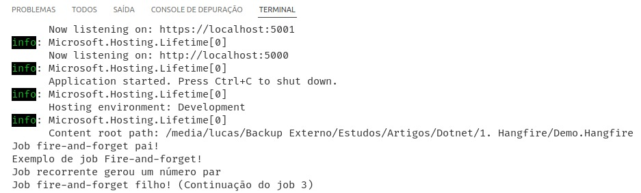
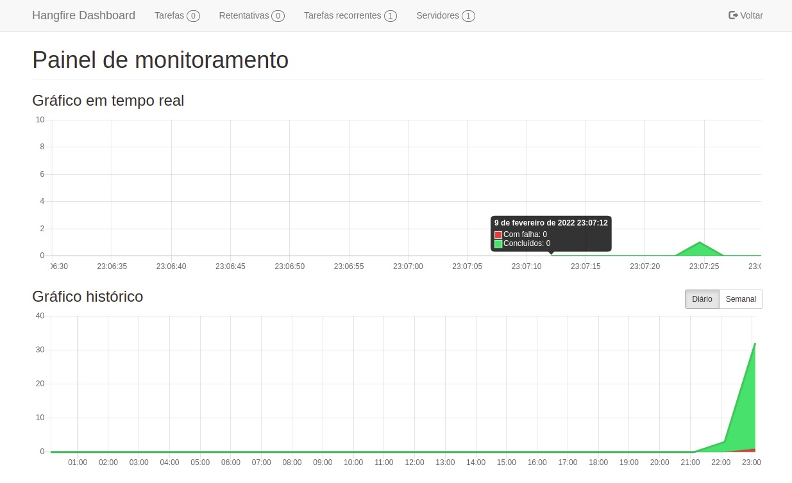

Se você já desenvolveu projetos de integração entre sistemas provavelmente já precisou dedicar algumas horas de estudo para elaborar uma estrutura capaz de executar determinadas rotinas a partir de um agendamento.

Neste artigo irei lhe apresentar o [Hangfire](https://www.hangfire.io/), uma biblioteca para .NET capaz de te ajudar no cenário mencionado acima ou em outros como:
- Disparo automatizado de e-mails;
- Importação em lote de xml, csv, json;
- Limpeza de arquivos temporários rotineiramente;
- Emissão automatizada de relatórios recorrentes.

## Conhecendo a biblioteca

O Hangfire é uma biblioteca open-source gratuita, inclusive para uso comercial, disponível no [nuget.org](https://www.nuget.org/packages/Hangfire/), que facilita a criação, execução e gerenciamento de jobs executadas em segundo plano, ou seja, operações que precisam ser executadas fora do pipeline de processamento de requisições da sua aplicação.

## Requisitos

Você pode utilizar o Hangfire independente da plataforma para a qual está programando, do tipo de projeto .NET, seja um Console Application, uma WebApp com Asp.Net ou uma aplicação Windows Forms. Neste artigo implemento uma Webapp para demonstração.

- .NET Framework 4.5 (Ou superior);
- .NET Core 1.0 (Ou posterior);
- Qualquer  plataforma compatível com .NET Standard 1.3.

## Instalando o Hangfire

Você pode adicionar o Hangfire ao seu projeto a partir dos pacotes distribuídos no NuGet. Se você simplesmente entrar no NuGet e pesquisar por Hangfire verá que existem várias extensões que fornecem uma série que recursos ou implementam novas abstrações úteis à biblioteca, mas não entrarei em detalhes das demais aqui, apenas saiba que elas existem e caso precise você encontra uma relação e um overview destas extensões na [documentação](https://www.hangfire.io/extensions.html) da biblioteca.

O básico que você precisará para fazer as coisas funcionarem está no pacote `Hangfire.Core`, e caso opte por implementar sua solução utilizando Asp.Net instale também o pacote correspondente.
```bash
dotnet add package Hangfire.Core
dotnet add package Hangfire.AspNetCore
```

Além destes, talvez você queira utilizar um armazenamento persistente para armazenar suas tarefas. No exemplo deste artigo utilizarei o [Sqlite](https://github.com/raisedapp/Hangfire.Storage.SQLite), mas você encontra a lista de storages disponíveis [aqui](https://www.hangfire.io/extensions.html#storages).
```bash
Hangfire.Storage.SQLite
```

## Configurando sua aplicação

Após instalar os pacotes necessários o primeiro passo para começar a utilizar o Hangfire é adicionar e configurar o serviço da biblioteca no container de resolução de dependências da sua aplicação. Para isso, adicione as seguintes linhas ao método `ConfigureServices` da classe Startup do seu projeto:
```csharp
services.AddHangfire(configuration => configuration
                .UseRecommendedSerializerSettings()
                .UseSQLiteStorage());

// Define a quantidade de retentativas aplicadas a um job com falha.
// Por padrão serão 10, aqui estamos abaixando para duas com intervalo de 5 minutos.
GlobalJobFilters.Filters.Add(new AutomaticRetryAttribute {
	Attempts = 3, DelaysInSeconds = new int[] { 300 } });

services.AddHangfireServer();
```

A seguir adicione o Dashboard oferecido para visualização e gerenciamento das Jobs configurada (esta etapa é opcional). Ainda na classe Startup, adicione o seguinte trecho ao método `Configure`:
```csharp
app.UseHangfireDashboard();
```

## Criando suas jobs

Com o Hangfire você consegue criar diversos tipos de tarefas, que em resumo, são a execução de métodos implementados na sua solução.

### Jobs _fire-and-forget_

Como o próprio nome diz, tarefas deste tipo são executadas apenas uma vez e depois "esquecidas". Porém você ainda conseguirá executá-las manualmente sempre que quiser acionando por meio do Dashboard que exibe o histórico de execução.

Para criar jobs _fire-and-forget_ utilize o método `Enqueue` da classe `BackgroundJob`:
```csharp
var jobId = BackgroundJob.Enqueue(
    () => Console.WriteLine("Job Fire-and-forget!"));
```

### Jobs _delayed_

Este tipo de job também é executada apenas uma vez, mas não de imediato, você consegue especificar um atraso para sua execução, seja de um dia, hora, minuto, entre outros.

Para criar jobs _delayed_ utilize o método `Schedule` da classe `BackgroundJob`:
```csharp
BackgroundJob.Schedule(
    () => Console.WriteLine("Job Delayed: 2 minutos após o início da aplicação"),
    TimeSpan.FromMinutes(2));
```

### _Recurring_ jobs

Jobs recorrentes permitem que uma tarefa seja executada muitas vezes por meio de um agendamento CRON definido.

Para criar jobs recorrentes utilize o método `AddOrUpdate` da classe `RecurringJob`:
```csharp
RecurringJob.AddOrUpdate(
    "Meu job recorrente",
    () => Console.WriteLine((new Random().Next(1, 200) % 2 == 0)
        ? "Job recorrente gerou um número par"
        : "Job recorrente gerou um número ímpar"),
    Cron.Minutely,
    TimeZoneInfo.Local);
```

### Jobs com _continuations_

As continuações permitem que você defina que a execução de uma job depende da finalização da execução de uma job pai.

Para criar jobs com continuação utilize o método `ContinueJobWith` da classe `BackgroundJob`:
```csharp
var jobId = BackgroundJob.Enqueue(() => Console.WriteLine("Job fire-and-forget pai!"));
BackgroundJob.ContinueJobWith(
    jobId,
    () => Console.WriteLine($"Job continuation! (Job pai: {jobId})"));
```

## Executando nossa demo

O código fonte desta aplicação de demonstração está disponível no [Github](https://github.com/lucasdemoraesc/Demo.Hangfire).

Com tudo que fizemos até aqui já podemos executar nossa aplicação e ver o Hangfire em ação!
Para isso, execute o comando para inicializar a aplicação a partir da pasta do projeto criado:
```bash
dotnet run
```

Assim que a aplicação subir você já verá algumas informações sobre o Hangfire e os logs gerados pelas jobs de disparo imediato implementadas:



### Acessando o Dashboard

O Dashboard do Hangfire pode ser acessado por meio da URL `http://localhost:5000/hangfire`. Logo no início ele nos exibe um painel de monitoramento das jobs executadas, e navegando pelas seções você encontra funcionalidades que permitem gerenciar a execução das jobs.



- Seção **Tarefas**: Lista as tarefas em execução, agendadas ou do histórico de acordo com seu status (enfileirada, agendada, em execução (processando), concluída, em falha, removida, aguardando). Para voltar a executar uma tarefa do histórico basta selecioná-la e clicar em "Tarefas enfileiradas".

- Seção **Retentativas**: Quando [configuramos](#configurando-sua-aplica%C3%A7%C3%A3o) o Hangfire em nossa demo aplicamos uma configuração que definia o número e o tempo para retentativas caso uma job venha a falhar. E caso isso aconteça é para esta seção que a job virá.

- Seção **Tarefas recorrentes**: Aqui você obtém a lista de tarefas recorrentes configuradas na sua aplicação. E caso deseje também pode selecionar uma, ou várias, tarefas da lista e dispará-las manualmente.

- Seção **Servidores**: Aqui você obtém a lista de servidores do Hangfire rodando.

## Considerações finais

O Hangfire além de ser uma solução completa e robusta, é extensível e possui compatibilidade com os mais diversos tipos de projetos dentro do ecossistema dotnet. Sendo assim é certamente uma excelente opção para a criação de tarefas no .NET, evitando os transtornos de precisarmos recorrer e nos amarrar ao Agendador de Tarefas do Windows hehehe.

O repositório do projeto de demonstração criado está disponível no github: https://github.com/lucasdemoraesc/Demo.Hangfire

No mais, espero que você tenha gostado deste artigo e que ele tenha lhe ajudado de alguma forma! Um grande abraço!
