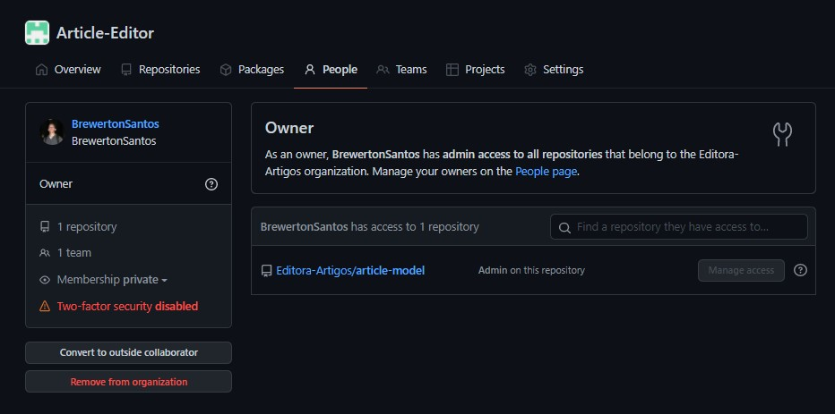
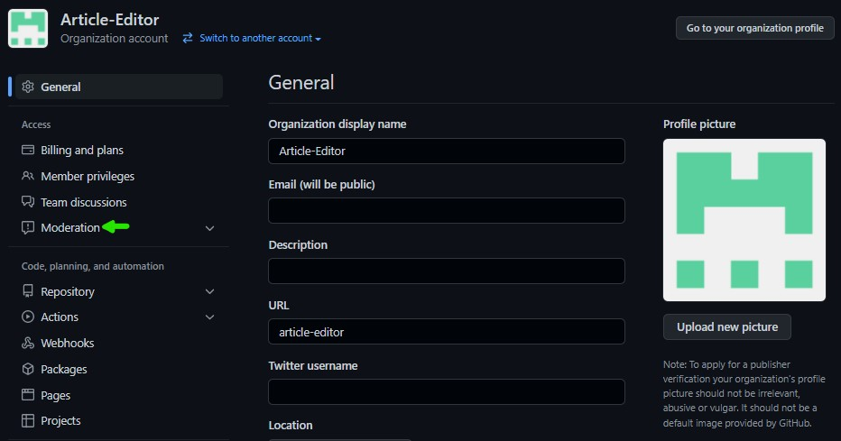

# Sumário

 1. [Introdução](#introducao)
 2. [Conta pessoal versus Conta organizacional](#conta-pessoal-versus-conta-organizacional)
 3. [Página de pessoas](#pagina-de-pessoas)
 4. [Moderação](#moderacao)
 5. [Agora é com você](#agora-e-com-voce)
 6. [Continue lendo](#continue-lendo)
 7. [Referências](#ref)

 

# Introdução

As definições dos recursos de repositórios, projetos e equipes foram explicadas e exemplificadas nos artigos anteriores. Desta vez nos atentaremos ao papel da organização dentro do GitHUb diferenciando uma conta organizacional da pessoal e descrevendo o funcionamento de algumas outras páginas não descritas antes.

Este artigo tem o objetivo de apresentar funcionalidades além do versionamento de código que o GitHub possui, portanto os exemplos e descrições encontrados são de carater introdutório ou seja, voltados para pessoas sem conhecimento ou com pouco conhecimento destes recursos.

 

# Conta pessoal versus Conta organizacional.

Antes de tudo vamos esclarecer a diferença entre uma conta pessoal e uma conta organizacional. As contas pessoais podem assim como as organizacionais ter inumeros repositórios, projetos e equipes. Mesmo que usemos o termo "conta organizacional" não significa que seja uma conta que pode-se ter acesso através do processo de login. A disponibilidade dos recursos aqui depende do seu nível de acesso.

Os recursos organizacionais são divididos em 6 níveis de acesso:

- **Proprietário**

    Estes tem acesso administrativo a todos os recursos da organização e por este motivo o próprio GitHub sugere que ao menos 2 pessoas o tenham mas o número de proprietários é ilimitado.

- **Integrante**

    Os integrantes tem capacidade de criar e modificar equipes, projetos e repositórios podendo ser limitado por configurações de cada um destes.

        O GitHub tem como configuração padrãoa limitação do acesso à configurações em geral, permitindo que apenas administradores tenham acesso. Para atribuir permissões adicionais é possível utilizar os seguintes níveis de acesso:

- **Gerente de cobrança**

    Os gerentes de cobrança são integrantes da organização com diferencial de terem acesso às configuralçies de cobrança. Estas funções são delicadas então pense bem antes de atribuir estas funções à um integrante.

- **Gerente de segurança**

    Assim como a função de *Gerente de cobrança* também é possível atribuir funções de segurança para um integrade. Ao fazer isto o integrante terá acesso à alguns recursos de segurança podendo assim gerenciar melhor uma equipe de segurança existente.

- **Gerente de aplicativo**

    Acesso aos recursos e configurações de específicos ou todos os aplicativos da organização.

- **Colaboradores externos**

    Os colaboradores externos são pessoas que contribuem com os projetos da organização mas não são membros. Você pode atribuir as funções de colaboradores externos quando decidir permitir acesso sem que o usuário tenha acesso à informações da organização.

`NOTA 1`: Para criar uma organização você pode seguir os passos descritos no artigo *GitHub - Trabalhando com projetos, equipes e organizações* que pode ser encontrado ao final deste artigo.

 

# Página de pessoas

Nesta página é possível visualizar e modificar informações de todos os membros da organização, seus níveis de acesso, segurança, visibilidade e de que equipes fazem parte. Além, claro! De também poder adicionar e remover membros.

Aoo clicar no nome da pessoa seremos redirecionados para o perfil da pessoa na organização onde podemos ter mais detalhes sobre os acessos do usuário assim como a possibilidade de transforma-lo em um collaborador externo ou remove-lo da organização.

 

# Moderação

Os recursos de moderação podem ser encontrados na aba de configurações da organização e são compostos por 3 funcionalidades:

- **Bloqueio de usuários**
  
    Impede que os usuários listados favoritem repositórios da organização, façam bifurcações de repositórios, observem, modifiquem páginas da wiki ou abram/comentem issues e pull requests.

- **Limitar interação**
    
    Restringem a interação de colaboradores externos como comentar, abrir issues ou criar pull requests. Mas cuidado, ao adicionar limites através do recurso de moderação as configurações referentes a estes recursos presentes em cada repositório da organização serão sobrepostas.

- **Limitar revisão de código**

    Aqui é possível especificar limites sobre a revisão de código em determinados repositórios e assim como o limite de interações acima descrito. É necessário ter cuidado ao atribuir configurações, já que configurações de limite de revisão de código nos repositórios descritos serão reescritas também. 

Você pode acessar os recursos de moderação da organização clicando na opção de Configurações da organização e logo depois em Moderação como mostram as imagem abaixo:

# Agora é com você

Este artigo encerra a série sobre *Gestão de projetos, organizações e quipes com GitHub*. Agora você pode utilizar estes recursos em seus projetos pessoais para desenvolver habilidade e entender como essas ferramentas afetam sua produtividade. Vamos lá, mão na massa!

 

# Continue lendo:

[Documentação com GitHub](https://balta.io/blog/documentacao-com-github)

[ASP.NET Deploy com GitHub Actions e Microsoft Azurel](https://balta.io/blog/aspnet-deploy-github-actions-azure)

[GitHub Packages e GitHub Actions - Distribuindo contextos delimitados](https://balta.io/blog/github-packages-github-actions-distribuindo-contextos-delimitados)

## Cursos relacionados

`Gratuito` | [Fundamentos do Git e Azure DevOps](https://balta.io/cursos/fundamentos-git-azure-devops)

 

## Referências
[Documentação do GitHub](https://docs.github.com/)
