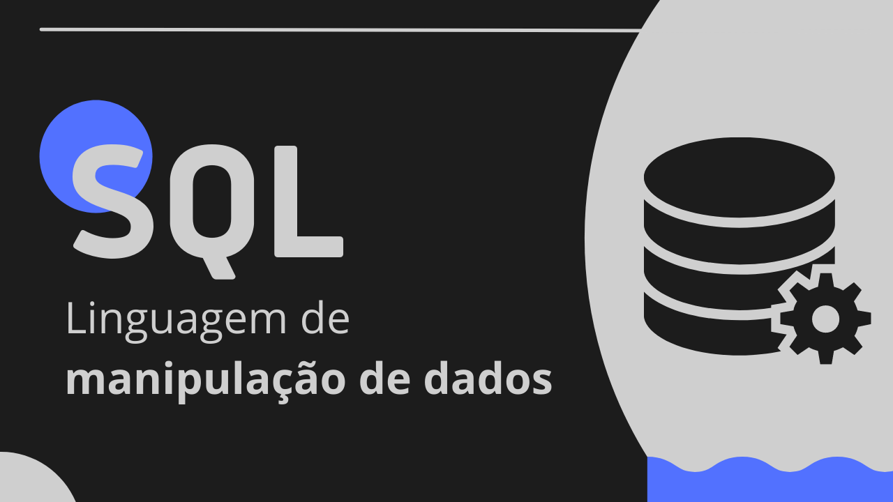
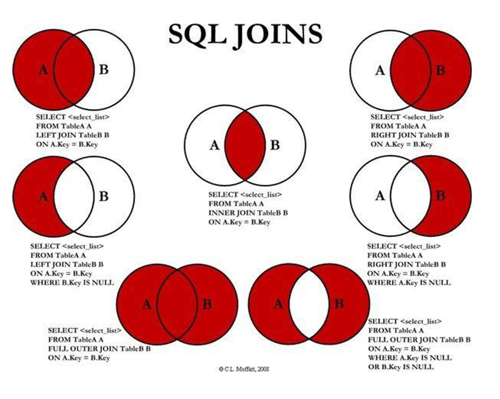
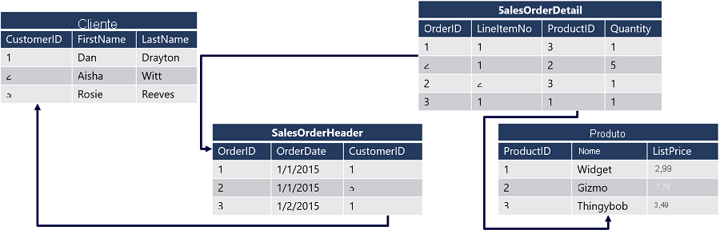

# Linguagens de Manipulação de Dados: Conheça o SQL!

Provavelmente você já ouviu falar em linguagens de marcação, de estilização e de programação, não é mesmo? Mas, você sabia que existem as **linguagens de manipulação de dados**? É exatamente sobre esse tipo de linguagem que vou te explicar agora. Continue lendo e entenda um pouco mais sobre o **SQL**!

## O que é SQL?

O SQL (Structured Query Language) é uma “Linguagem de Consulta Estruturada”, utilizada para acessar e manipular registros em um banco de dados. Dito isso, vale ressaltar que essa linguagem é executada de forma declarativa. Mas afinal de contas, o que é uma linguagem declarativa? Existem outros tipos de linguagens? 

Claro, e dentre as principais destacam-se as próprias linguagens declarativas e procedurais. De forma resumida, elas podem ser definidas como:

* **Linguagem declarativa:** é executada em bloco (não necessariamente na ordem em que foi escrita), de maneira lógica.
* **Linguagem procedural:** seus comandos são executados na mesma sequência em que foram escritos, sendo uma espécie de passo a passo a ser seguido.

Vale lembrar que, embora dê suporte a ambas, na maior parte do tempo o SQL segue a semântica declarativa.

Além disso, é importante destacar que o SQL é utilizado para se comunicar com **banco de dados relacionais**, e é exatamente por isso que é necessário aplicar a “Teoria dos conjuntos” na construção das consultas.

## Teoria dos conjuntos x SQL

Sabe aquela teoria matemática que você estudou no ensino fundamental/médio e não sabia quando iria utilizar isso na sua vida? É, o momento chegou!

A “Teoria dos conjuntos” é uma teoria matemática capaz de agrupar elementos entre dois ou mais grupos. Ela utiliza a relação de pertinência (pertence e não pertence), união e intersecção para relacionar os elementos de conjuntos distintos.

No SQL, cada tabela representa um conjunto e por isso os conceitos da teoria dos conjuntos passam a ser tão importantes nos bancos de dados relacionais.

*Exemplo de união entre conjuntos utilizando o comando JOIN do SQL.*

## Banco de Dados Relacionais

Os banco de dados relacionais são formados por tabelas compostas por linhas e colunas, que podem se relacionar entre si.

As tabelas representam uma **entidade** (objetos, nas linguagens de programação), tais que possuem atributos, representados pelas colunas. Mas como as tabelas conseguem se relacionar?

Elas se relacionam por meio de chaves identificadoras, que devem estar presentes em duas ou mais tabelas para que o relacionamento exista, os famosos IDs. Dentre as chaves identificadoras, destacam-se:

* **Chave Primária:** IDs dos registros de uma entidade “X”, localizados na própria tabela da entidade “X”.
* **Chave Estrangeira:** IDs dos registros de uma entidade “X”, localizado em uma outra tabela “Y” e que faz referência a chave primária da tabela “X”.

*Esquema que representa a utilização de chaves primárias e estrangeiras em diferentes tabelas.*

Dessa forma, por meio de elementos em comum em diferentes tabelas, é possível aplicar a teoria dos conjuntos e utilizar a linguagem SQL para realizar consultas e acessar dados de múltiplas tabelas ao mesmo tempo.

---

### Referências:
https://docs.microsoft.com/pt-br/learn/modules/introduction-to-transact-sql/

https://www.todamateria.com.br/teoria-dos-conjuntos/
