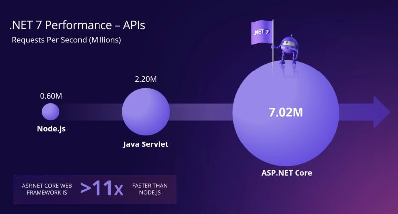

O ASP.NET 8 chega dia 14 de Novembro deste ano (2023) e com ele venha talvez uma das maiores mudanças do Framework de todos os tempos.

## 📗 eBook COMPLETO: Blazor com .NET 8
- [👉 Clique aqui para baixar seu eBook 👈](https://go.balta.io/ebook-blazor?utm_source=Website&utm_campaign=website-to-lp&utm_content=blog-post&utm_medium=article)

## Por que ainda usamos o ASP.NET hoje?

Sabemos que C# é a linguagem de programação, .NET é o Framework (Conjunto de bibliotecas que torna o desenvolvimento mais rápido) e que o próprio .NET é escrito em C#.

O ASP.NET é o principal Framework para criação de Aplicações Web, APIs e WebSites da Microsoft, que faz uso do .NET como base (Ele é escrito em cima do .NET).

Assim como o C# e o .NET, o ASP.NET tem mais de 20 anos de existência e evoluiu muito nesse meio tempo. Atualmente ele é um dos Frameworks mais rápidos do mercado, ultrapassando com folga seus principais concorrentes.

## Qual era o problema do ASP.NET?

Sendo sincero, não era bem um problema, era mais um expansão que faltava. O ASP.NET sempre foi muito popular no Backend, para criação de APIs.

Porém, com a popularização de Frameworks SPA (Single Page Applications) o ASP.NET acabou sendo deixado de lado em diversos cenários.

Isto por que os navegadores executam apenas HTML, CSS e JS, tornando quase que obrigatório o uso do JavaScript.

O ASP.NET consegue servir muito bem a parte do SSR (Server Side Rendering) ou renderização do lado do servidor, mas ele para por aí.

Na verdade ele só faz isto! Toda e qualquer aplicação Web (Não API) que você criar com ASP.NET, vai ser renderizada do lado do servidor.

Isto significa que se você quiser atualizar um simples contador na tela por exemplo, precisa enviar uma requisição para o servidor, que vai gerar um HTML, CSS e JS e enviar de volta para tela.

Já nas aplicações SPA (Aplicações de página única), sua aplicação é renderizada uma vez e após isto, buscamos somente os dados no servidor (Requisição para uma API, normalmente JSON) e geramos o HTML necessário via JavaScript.

## SSR vs SPA

Tanto o SSR quanto o SPA desenvolvem um papel único no cenário Web, e ambos tem suas características.

### Server Side Rendering

Do lado do SSR, podemos destacar diversos pontos fortes e fracos que já comentamos, mas em resumo eu elegeria dois principais:

- Carregamento mais rápido (Só o que precisa)
- Melhor otimização do SEO (Google e buscadores)

Abaixo temos uma ilustração de como funcionam as requisições e respostas em uma aplicação que se beneficia do SSR.

Podemos notar que é uma relação extremamente simples, que desfruta da base de toda aplicação Web, que é uma requisição e uma resposta.

### Single Page Application

Do lado do SPA, também podemos destacar diversos pontos fortes e fracos que já comentamos, mas em resumo eu elegeria três principais:

- Carregamento inicial mais demorado
- Melhor interação com usuário
- Mais responsiva

Abaixo temos uma ilustração de como funcionam as requisições e respostas em uma aplicação que se beneficia do SPA.

Como podemos ver, neste modelo, nós temos o carregamento inicial similar ao SSR, porém, posteriormente fazemos apenas requisições assíncronas, recebendo um JSON como retorno e gerando o HTML necessário.

> *AJAX é a sigla para Asynchronous JavaScript and XML, é um termo que foi muito usado no passado, nos primórdios das requisições assíncronas. Hoje podemos chamar apenas de “requisição”, já que o XML nem é mais utilizado.*
> 

## Apresentando o Blazor

Há alguns anos a Microsoft chegou com uma proposta legal e ousada, que inclusive eu comparei com Silverlight na época.

Embora simples, a proposta do Blazor era trazer suporte aos itens que o SPA tem de legais como responsividade, interação com usuário e também unir isto ao SSR com um carregamento mais rápido.

Mas estas de longe eram as propostas mais ousadas, a maior delas foi introduzir o C# no Frontend, não no lugar do JavaScript (Você ainda pode usar JS, inclusive interoperar com C#) mas sim como um complemento a ele.

Então, ela fechou o ciclo, com ASP.NET no Backend e SSR e Blazor para SPA, dando de quebra a possibilidade de trabalhar com C# no Frontend.

O Blazor ainda foi segmentando em duas partes, uma chamada de Blazor Server e outra de Blazor Wasm, ambas com propósitos diferentes.

### Blazor Server

A ideia principal do Blazor Server é rodar no servidor, mas diferente de como o ASP.NET faz com Razor Pages.

Enquanto o ASP.NET renderiza toda a página novamente, o Blazor foi mais esperto. Ele mantém uma conexão aberta e atualiza só o componente que está sendo manipulado.

FONTE: Microsoft Learn

Isto significa que temos a aplicação servida inicialmente pelo servidor, de forma rápida e posteriormente, os componentes são atualizados através de um Socket (Conexão que fica aberta direta com servidor sendo muito mais rápida).

### Blazor WebAssembly

Na outra mão temos o Blazor WebAssembly, ou Blazor WASM, que faz um trabalho bem diferente do seu irmão.

Web Assembly não é uma exclusividade da Microsoft, outras tecnologias como Rust se beneficiam dele, e ele basicamente permite a execução de códigos de máquina no navegador utilizando linguagens que não são necessariamente o JavaScript.

FONTE: Microsoft Learn

Isto não só implica em uma maior performance como em uma maior flexibilidade, dando a opção de reuso por exemplo, de regras de negócio escritas em C#.

Em resumo, o Blazor Wasm é literalmente o .NET rodando dentro do navegador, não há nada (Exceto os arquivos estáticos) sendo servidos no servidor.

Então após o carregamento inicial da aplicação, temos uma excelente performance e claro, o uso e abuso do nosso querido C#.

## Os problemas do Blazor

Mas como nem tudo são flores, tanto o Blazor Server quanto o Blazor Wasm tem seus defeitos. Enquanto o Blazor Wasm tem uma ótima performance, sua fraqueza é o tamanho do seu App, que precisa do .NET para ser executado e consequentemente fica muito maior do que uma aplicação convencional.

No lado do Blazor Server, manter a conexão sempre aberta com o servidor pode ser custoso e renderizar novamente os componentes nem sempre é o jeito mais performático.

Além disso, perdemos a parte do SEO, já que só o “esqueleto” da página é renderizado inicialmente, o que deixa o Google triste.

Para finalizar, não conseguimos (Até o .NET 7) utilizar Blazor Server, WASM e SSR juntos, e esta é a grande novidade do .NET 8.

## Como fica o ASP.NET?

Mas se no .NET 8 podemos utilizar SSR, WASM e recursos do Blazor Server, por que ainda precisamos do ASP.NET?

Nos últimos anos o ASP.NET sofreu diversas melhorias significativas, desde os Top-Level Statements (Não foi só para o ASP.NET) até a chegada dos Minimal APIs.

Sendo assim, eu encaro o ASP.NET com mais foco em APIs a partir do .NET 8, sendo mais específico em Minimal APIs.

Em caso de aplicações SSR (Websites) você ainda pode manter o Razor Pages, mas tem muita coisa que já pode ser feita com Blazor.

Para o MVC o cenário é um pouco menos favorável, visto que a arquitetura era considerada complexa para iniciar um projeto, e consome mais recursos que os Minimal APIs.

Então utilizar o MVC fica mais para projetos que realmente necessitem esta arquitetura. E antes de dizer que não tem como organizar bem as Minimal APIs, dá uma conferida neste repositório.

[https://github.com/balta-io/3001](https://github.com/balta-io/3001)

## Unificação dos projetos

Indo além, no .NET 8 temos a unificação dos templates também, sendo que para criar uma nova aplicação Blazor com suporte a SSR, WASM e Blazor Server, basta usar o comando `dotnet new blazor`.

Este novo projeto combina recursos do ASP.NET, Blazor Server e Blazor Wasm, nos permitindo criar Razor Components, Razor Pages, Blazor Pages, Blazor Components e até utilizar o Blazor WebAssembly no projeto.

### Templates anteriores

Ainda é plenamente possível utilizar templates anteriores como `blazorserver`, `blazorwasm`, `razorpages` e `mvc`. Nada foi removido, apenas adicionado.

### Qual template escolher?

A opção mais flexível é o `dotnet new blazor` por possuir recursos tanto para SSR quanto SPA, dando ainda suporte ao WASM.

Porém é sempre legal fazer uma análise para entender o que seu projeto de fato precisa e adicionar somente o necessário.

De qualquer forma, não se preocupe, dá pra adicionar o Blazor a um projeto ASP.NET e adicionar ASP.NET a um projeto Blazor.

## Conclusão

Esta é uma mudança significativa no ASP.NET que leva o Blazor para um novo patamar. Sendo possível criar aplicações SSR, SPA e WASM com o mesmo Framework, torna o Blazor uma opção simples e direta para quem gosta de .NET e quer usar C# no Frontend.
