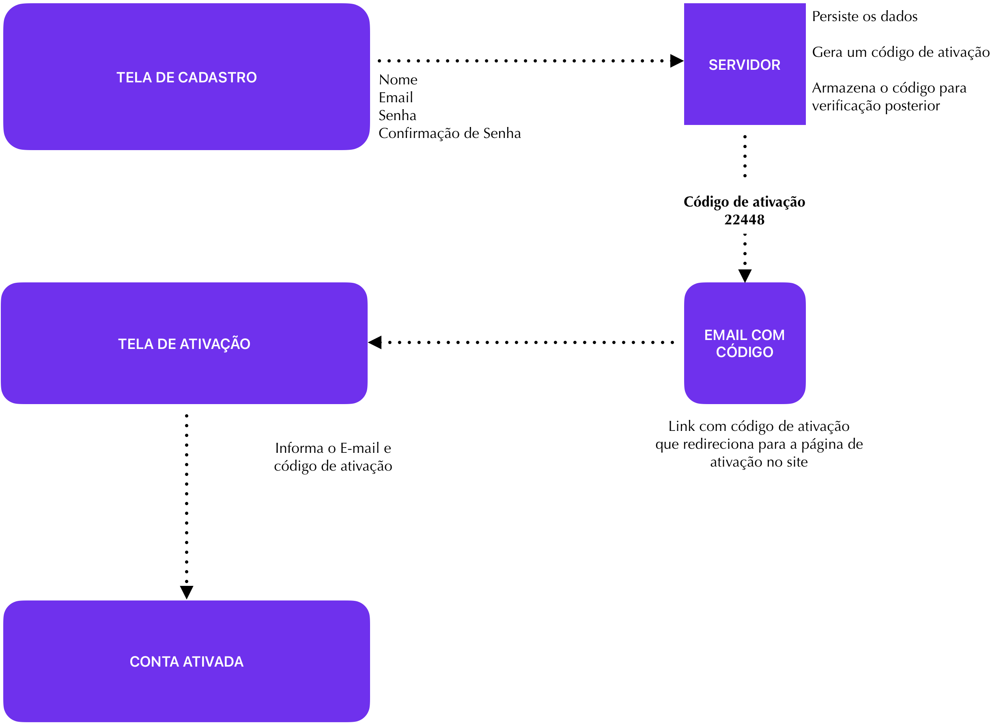

Neste artigo vamos aprender o que é autenticação e autorização e entender como estes modelos se aplicam aos cenários de APIs.

## O que é autenticação?

Autenticação é o processo que diz quem você é. Por exemplo, em um processo de autenticação interno ou externo, eu estou garantindo que sou o André Baltieri, através do E-mail xyz@balta.io.

Este processo pode ser feito de diferentes maneiras, via usuário e senha, via E-mail e senha ou mesmo via redes sociais, os famosos “Login com Google”, “Login com Facebook”.

De qualquer forma, não importa como, o processo é sempre o mesmo, garantir que quem está dizendo que é “xyz@balta.io” é realmente o “André Baltieri”.

### Como garantir que eu sou eu?

O primeiro passo que precisamos é garantir que uma pessoa está ligada a um E-mail ou um nome de usuário, e este processo é relativamente simples.

No caso da garantia de um E-mail ser de quem ele realmente disse que é, basta no processo de registro do usuário, enviar um E-mail com um código a ele.

### Autenticação Externa

Outro tipo de autenticação muito comum é utilizando alguma rede social ou serviço externo. Neste modelo, você delega a responsabilidade para outro servidor, o que pode ser uma boa, já que o processo de verificação de contas do Google ou Microsoft por exemplo são bem mais complexos e completos do que possivelmente o seu será.

Neste formato, o que fazemos é no login, gerar um token de ativação e redirecionar o usuário para uma plataforma externa.

Após autenticado, o usuário retorna para nossa plataforma com um token e assim damos andamento na requisição.

Em suma, qualquer pessoa pode fornecer este serviço, basta realizar a implementação do OIDC (Open Id Connect), um protocolo aberto de autenticação.

Existem servidores OIDCs prontos como o Identity Server ou o Keycloak, ambos fornecem uma ótima implementação e são completos em recursos.

Resumindo, se o [balta.io](http://balta.io) tivesse uma implementação do OIDC, você poderia adicionar um botão “Login com balta” em seu site.

Como o custo e risco de manter um OIDC próprio são altos, a recomendação é sempre começar do mais básico, implementando autenticação oAuth com JWT.

## O que é autorização

Se autenticação diz quem você é, autorização diz o que você pode fazer, são os famosos Roles ou Perfis, e que no [ASP.NET](http://ASP.NET) se estendem para políticas (Policies) e afirmações (Claims).

Enquanto a autenticação segue em diversas vezes uma padronização, a autorização não tem necessariamente uma regra. Eu mesmo já fiz sistemas onde ao invés de Roles utilizávamos Tags.

De qualquer forma, a ideia aqui é, sabendo que o “xyz@balta.io” é o “André Baltieri”, o que ele pode fazer dentro deste sistema?

Note que estamos falando DESTE sistema, pois a autorização varia muito, inclusive entre módulos, páginas e até mesmo botões.

Podem haver páginas no sistema que eu posso ver, mas não posso editar e a autorização precisa tratar tudo isto.

Na maioria dos casos também, a autorização é CUMULATIVA ou seja, eu posso ter vários perfis como “admin”, “employee”,  “sales” e cada um deles ter funções distintas que são acumuladas.

### Por onde começar?

Existem modelos prontos como o Keycloak e Identity Server que são implementações do OIDC, mas também existem Frameworks como o [ASP.NET](http://ASP.NET) Identity que nos permite criar um sistema de usuários em poucos minutos.

Porém, minha recomendação é pelo menos para fins de estudo, que você implemente manualmente um sistema de autenticação, para conhecer as entranhas e saber tudo o que está acontecendo.

Desta forma, te convida a implementar um modelo de autenticação híbrido, contendo autenticação interna e externa, implementando oAuth com [ASP.NET](http://ASP.NET) e Blazor.

## Autenticação e autorização em APIs

Como você já deve imaginar, tudo começa na API, visto que a segurança no lado do cliente é sempre fraca, todo processo deve rodar no servidor.

Armazenar um usuário e seus perfis é uma tarefa relativamente simples, incluindo ler este dados e enviar para tela, o problema está no armazenamento destes dados do outro lado.

Deixa eu te explicar melhor, em APIs nós nunca ficamos autenticados ou autorizados, a cada requisição este processo é feito. Isto se repete para toda requisição.

Existe um motivo para isto, e até um tempo atrás, utilizávamos sessão para manter estes dados em memória e o usuário permanecer conectado.

Com a distribuição das aplicações em diferentes servidores, manter o usuário conectado não é algo viável, pois os servidores não compartilham memória.

Então imagina que você acessou o site do [balta.io](http://balta.io) agora e fez o login, o servidor armazenou seus dados de login em memória e você está agora visualizando uma aula com 10 minutos de duração.

Após terminar de ver a aula, você clica no botão concluir, porém, o servidor que você se autenticou previamente está ocupado, com muita carga. Neste momento entra em ação o Load Balancer ou balanceador de carga.

Ele rapidamente identifica que existe outro servidor do [balta.io](http://balta.io) e que está livre, desocupado, então manda sua requisição para lá.

Como os servidores não compartilham memória, logo, você não está autenticado neste servidor e sua requisição falha com o erro 401.

Mudando o cenário para autenticação que temos hoje, onde a cada requisição você precisa se autenticar, este erro deixa de acontecer.

Neste modelo, geramos um Token de acesso, baseado em uma chave privada que só o servidor tem (Ela tem que ser comum entre os servidores) e então a cada requisição, o Frontend envia este token.

Com o Token em mãos, como temos a chave privada, conseguimos descriptar ele e obter os valores do usuário (E quaisquer outros valores que ele tenha).

Você pode também armazenar os Tokens para uma maior validação, mas isto implica em pelo menos uma requisição no banco de dados a cada requisição autenticada que sua API recebe. 

## Conclusão

Neste artigo pudemos ver como dois modelos de acesso, mesmo com anos de vida, ainda podem nos fornecer visões diferentes.

Entendemos o que é autenticação e autorização e como estes mecanismos funcionam dentro das APIs.