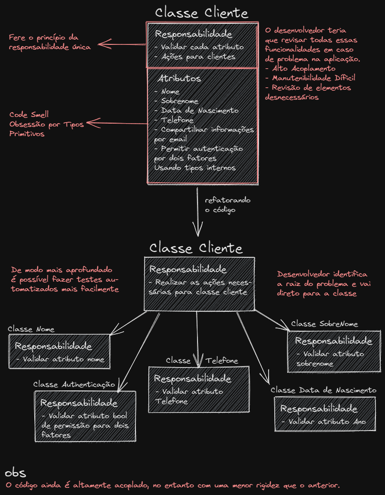

# Sumário
1. [Introdução](#introducao)
2. [Os problemas](#problemas)
3. [Solução](#solucao)
4. [Esquematização](#esquema)
5. [Fontes Alternativas](#fontes)

<div style="display: flex; align-items: baseline;">
<h1> Obsessão por Tipos Primitivos </h1><p style="padding-left: 5px;">por Otávio Villas Boas</p>
</div>

<div id="introducao"></div>

## Introdução
Apesar de não haver [Tipos Primitivos](https://www.macoratti.net/17/01/cshp_primit1.htm#:~:text=Os%20tipos%20primitivos%20n%C3%A3o%20s%C3%A3o,Char%2C%20Double%2C%20e%20Single.) especificados pela própria [linguagem C#](https://docs.microsoft.com/pt-br/dotnet/csharp/tour-of-csharp/), existem aqueles tipos embutidos na [plataforma .NET](https://docs.microsoft.com/pt-br/dotnet/core/introduction) no [CLR](https://pt.wikipedia.org/wiki/Common_Language_Runtime) (Você pode acessar esses tipos [nessa referência](https://docs.microsoft.com/pt-br/dotnet/csharp/language-reference/builtin-types/built-in-types)). Tais tipos, já embutidos no CLR, são usados normalmente de forma inadequada, já que, desenvolvedores como eu, **buscam facilidade** para **representar valores** como Número de Telefone, CPF's, **com o uso de Inteiros e String's**. No entanto, obsessão por tipos primitivos provocam a **deficiência da boa qualidade do código para manutenção**, **repetição devasada dos comandos** e **dificuldade para testagem do código** [(veja a importância da testagem aqui)](https://github.com/balta-io/blog/blob/main/fundamentos-testes-de-unidade/index.md). 

Nesse artigo, você verá como funciona esse problema, exemplos, principais complicações provocadas por ele e a solução para que você saiba como solucionar.


<div id="problemas"></div>

## Os problemas

Os problemas ocasionados por essa obsessão são sentidos a partir do momento em que percebe-se o uso de **tipos internos para representar objetos**.

Veja o código a seguir:

```csharp
public class Cliente
{
    public string Nome { get; set; }
    public string Sobrenome { get; set; }
    public string Telefone { get; set; }
    public int AnoNascimento { get; set; }
    public bool CompartilharPropagandasPorEmail { get; set; }
    public bool AutenticaçãoDeDoisFatores { get; set; }


    public Cliente(string nome, string sobrenome, string telefone, int anoNascimento, bool compartilharPropagandasPorEmail, bool autenticaçãoDeDoisFatores)
    {
        this.Nome = nome;
        this.Sobrenome = sobrenome;
        this.Telefone = telefone;
        this.AnoNascimento = anoNascimento;
        this.CompartilharPropagandasPorEmail = compartilharPropagandasPorEmail;
        this.AutenticaçãoDeDoisFatores = autenticaçãoDeDoisFatores;
    }
}
```

Como pode-se perceber os **atributos** da classe cliente são denotados por tipos internos (string, int, bool). A primeiro momento parece estar tudo correto, certo? No entanto, imagine diversos **métodos que dependem dessa classe cliente**, tais métodos realizariam frequentemente validações para que a aplicação funcione corretamente que posteriormente acarretaria em **repetição desnecessária de validações dos atributos**, já que a cada vez que a classe for instanciada o desenvolvedor teria que realizar verificações. Sendo assim, não haveria contribuição com o princípio [Don't Repeat Yourself](https://www.macoratti.net/16/04/net_dry1.htm), que diz que não devemos **reproduzir mais de uma vez o código de execução**. Tendo isso em vista, uma das alternativas adotadas pelos desenvolvedores seriam realizar a apuração dessas propriedades de tipos internos por meio do [Construtor](https://docs.microsoft.com/pt-br/dotnet/csharp/programming-guide/classes-and-structs/constructors) certo? Veja a seguir:

```csharp
public class Cliente
{
    public string Nome { get; set; }
    public string Sobrenome { get; set; }
    public string Telefone { get; set; }
    public int AnoNascimento { get; set; }
    public bool CompartilharPropagandasPorEmail { get; set; }
    public bool AutenticaçãoDeDoisFatores { get; set; }


    public Cliente(string nome, string sobrenome, string telefone, int anoNascimento, bool compartilharPropagandasPorEmail, bool autenticaçãoDeDoisFatores)
    {
        if (string.IsNullOrEmpty(Sobrenome))
        {
            throw new Exception("O sobrenomenome necessariamente não pode ser nulo");
        }
        else
        {
            this.Sobrenome = sobrenome;
        }

        if (string.IsNullOrEmpty(Nome))
        {
            throw new Exception("O nome necessariamente não pode ser nulo");
        }
        else
        {
            this.Nome = nome;
        }

        if (string.IsNullOrEmpty(telefone))
        {
            throw new Exception("O telefone necessariamente não pode ser nulo");
        }
        else
        {
            if (telefone.Length != 9 && telefone.Length != 8)
            {
                foreach (char Letra in telefone)
                {
                    if (char.IsDigit(Letra) is false)
                    {
                        throw new Exception("O telefone só pode conter dígitos");
                    }
                }
            }
            this.Telefone = telefone;
        }

        // CONTINUA OUTRAS VALIDAÇÕES
    }
}
```
Como pôde-se perceber nosso código não ficou consistentemente com boa manutenibilidade. Isso acontece pois a classe não tem [Responsabilidade Única](https://www.macoratti.net/08/06/net_srp1.htm#:~:text=%E2%80%93%20Se%20uma%20classe%20possuir%20mais,de%20ser%20posto%20em%20pr%C3%A1tica.) de realizar ações necessária para clientes, ela também tem que validar todos os atributos, ou seja, além de validar ela tem que realizar ações (não havendo um único motivo para que a classe mude). Um desenvolvedor utilizando um sistema com funcionalidades implementadas desse modo teria **dificuldade** para **encontrar a raiz das validações**  e em momentos de refatoração desse código ele teria um "problemão", haja vista que diversas validações estão em um mesmo local. Desse forma, retrata-se o que se chama de [Code Smell](https://www.macoratti.net/20/11/c_refator3.htm). Code Smell é o nome dado para códigos que possuem "mau cheiro", tais códigos possuem uma **alta rigidez, complexidade, fragilidade e com baixa flexibilidade**


<div id="solucao"></div>

## Solução

Para **solucionar** esse pequeno problema (que a longo prazo podem causar implicações significativas) é muito simples, **cria-se classes para cada atributo** de modo que possua **responsabilidade única**: Validar o valor. Veja exemplos a seguir:

```csharp
public class Nome
{
    public string nome { get; private set; }

    public Nome(string NomeTexto)
    {
        
        if (string.IsNullOrEmpty(NomeTexto))
        {
            throw new Exception("O nome necessariamente não pode ser nulo");
        }
        
        foreach (char Letra in NomeTexto)
        {
            if (char.IsLetter(Letra) is false && char.IsWhiteSpace(Letra) is false) // WhiteSpace caso seja nome Composto
            {
                throw new Exception("O nome só pode conter apenas letras e espaços em brancos");
            }
        }
        this.nome = NomeTexto;

    }

    public override string ToString()
    {
        return nome;
    }
}
```

```csharp
public class Ano
{
    public int ano { get; private set; }

    public Ano(int AnoValor)
    {
        if (AnoValor.ToString().Length is not 4)
        {
            throw new Exception("O ano tem que ter 4 caracteres.");
        }

        this.ano = AnoValor;
    }
}
```

Refatorando nossa classe cliente:
```csharp

public class Cliente
{
    public Nome Nome { get; set; }
    public Sobrenome Sobrenome { get; set; }
    public Telefone Telefone { get; set; }
    public Ano AnoNascimento { get; set; }
    public PermissãoCompartilharPropagandasPorEmail CompartilharPropagandasPorEmail { get; set; }
    public PermitirAutenticaçãoDeDoisFatores AutenticaçãoDeDoisFatores { get; set; }


    public Cliente(Nome nome, Sobrenome sobrenome, Telefone telefone, Ano anoNascimento, PermissãoCompartilharPropagandasPorEmail compartilharPropagandasPorEmail, PermitirAutenticaçãoDeDoisFatores autenticaçãoDeDoisFatores)
    {
        this.Nome = nome;
        this.Sobrenome = sobrenome;
        this.Telefone = telefone;
        this.AnoNascimento = anoNascimento;
        this.CompartilharPropagandasPorEmail = compartilharPropagandasPorEmail;
        this.AutenticaçãoDeDoisFatores = autenticaçãoDeDoisFatores;
    }
}
```

Portanto, a partir do que foi abordado, pode-se perceber como **sintetizamos o código** e agora toda vez que a classe cliente for instanciada as validações serão realizadas, de modo que cada classe terá sua própria responsabilidade e por conseguinte haverá uma **desmembração das classes em pequenos fragmentos**. Veja uma esquematização:

<div id="esquema"></div>



<div id="fontes"></div>

## Fontes Alternativas
- [https://macoratti.net/21/05/c_primobsess1.htm](https://macoratti.net/21/05/c_primobsess1.htm);
- [https://eximia.co/obsessao-por-tipos-primitivos/](https://eximia.co/obsessao-por-tipos-primitivos/);