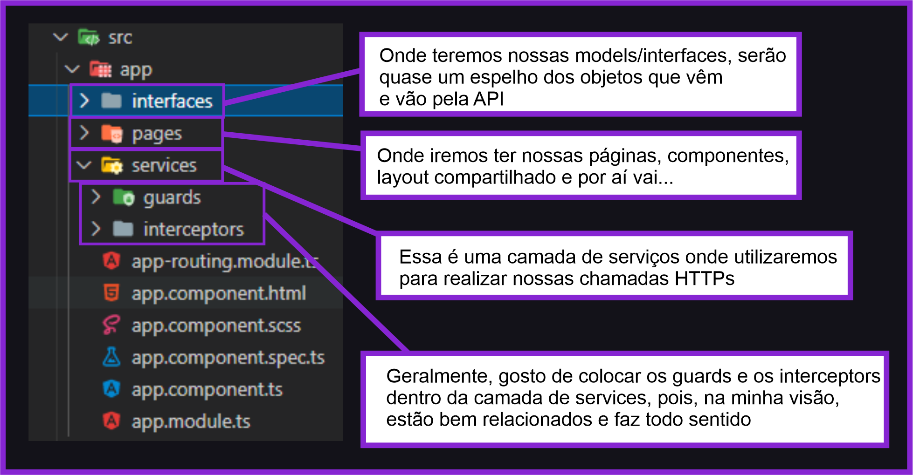
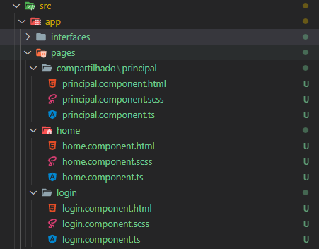
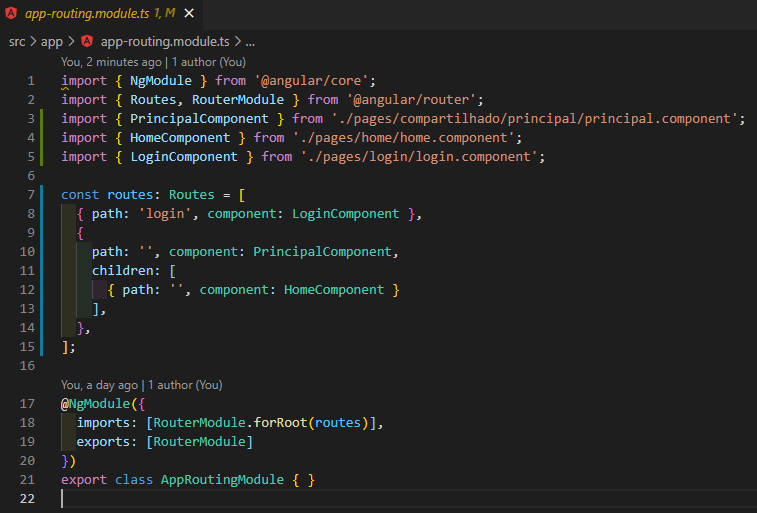
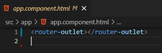
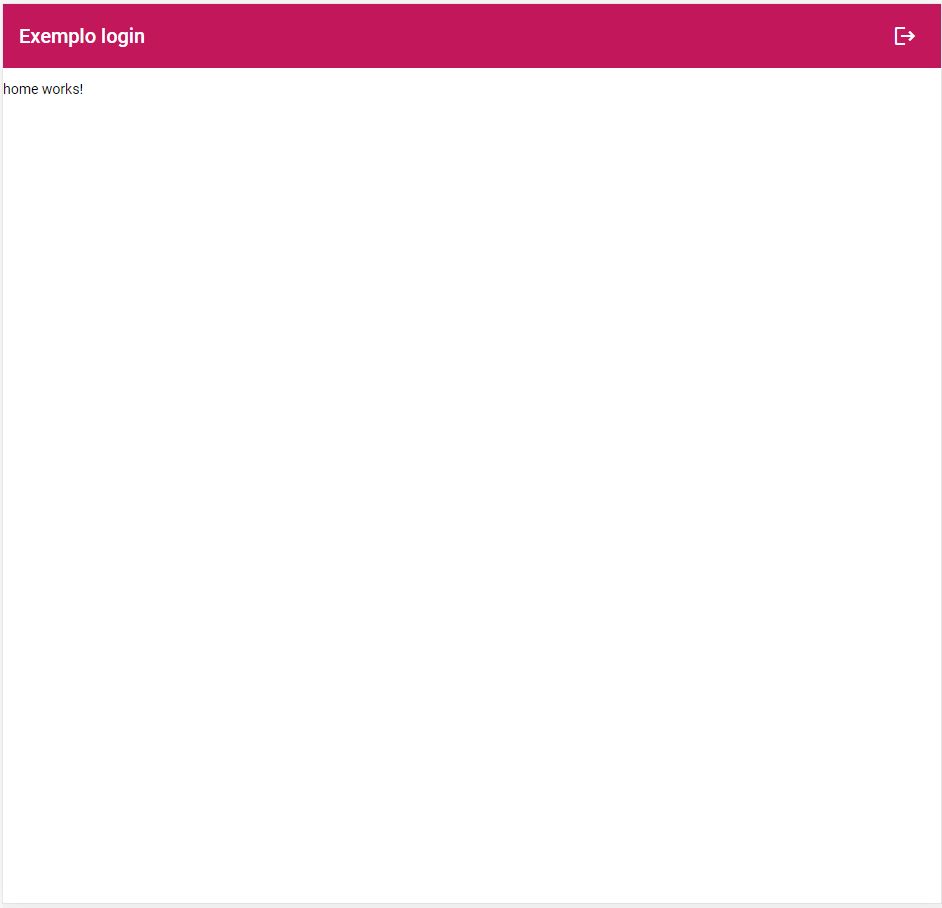
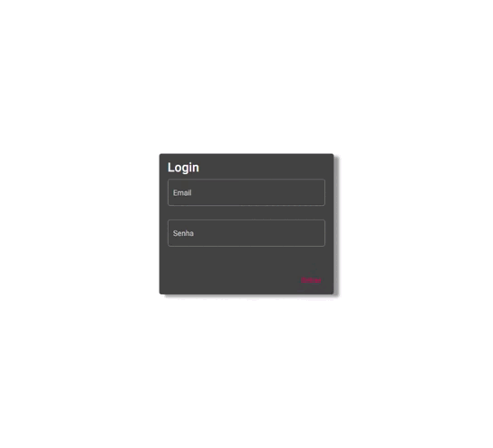

# Introdução 

Fazer login/logout, muitas vezes, parece ser algo muito simples, porém, ao nos depararmos com a necessidade do mesmo, vemos que não é tão simples assim, ainda mais para quem não tem tanta intimidade com storage, route guards e token interceptors. Neste artigo, irei explicar de forma simples e prática, como realizar um login/logout completo e funcional utilizando Angular.


# Primeiros passos

Os primeiros passos é entender o que utilizaremos e o porquê utilizaremos:

<strong>Storage:</strong> Será o responsável por armazenar os dados do usuário logado localmente, para que possamos utilizá-los quando necessário (IdUsuario, Token, Nome, etc). Se possível, utilize criptografia para armazenar esses dados, pois eles serão visíveis.
  
<strong>Route guards ou guarda de rotas:</strong> Será o responsável por verificar se o usuário que está acessando determinada rota, está logado ou não, e assim, redirecioná-lo caso seja necessário.
  
<strong>Token interceptor:</strong> Será o responsável por interceptar nossas chamadas https que serão realizadas para alguma API, e que a mesma necessite do token do usuário. Exemplo: o endereço base da nossa API é https://localhost:5001/v1. Sempre que houver uma chamada para essa API, nosso token interceptor irá interceptar essa chamada e adicionar no header o token do usuário. Com isso, você não precisará colocar o token em todas as chamadas que irá fazer para essa API.


# Bora lá!

Irei partir do princípio que você já saiba criar um projeto em Angular e tenha os conhecimentos prévios no framework. E caso não saiba, a documentação é muito rica, basta consultar.

Com o projeto já criado, irei utilizar a seguinte estrutura:



><h4>Estilizando o projeto</h4>

Para estilizar minhas páginas, formulários, botões, etc, irei utilizar o <strong>Angular Material</strong>, porém, você pode utilizar o framework de sua preferência.

Caso queira utilizar o mesmo que eu, basta digitar no seu terminal: <code>ng add @angular/material</code>
Em seguida escolher um tema e dar y (YES) para sempre rsrs.

Iremos importar os módulos que vamos utilizar do Material em nosso módulo principal app.module.ts, e aproveitando a viagem, iremos importar os módulos necessários para nossos formulários reativos e nossas chamadas HTTPs, que ficará assim:


# Criando nossos componentes

Agora iremos criar três páginas/componentes, que serão: a <strong> Home (que o usuário só poderá acessar caso já esteja logado)</strong>, a <strong>Login (que o usuário só poderá acessar caso não esteja logado)</strong> e a <strong>Principal (que geralmente utilizamos como layout base, com header e footer)</strong>.

Utilizaremos os seguintes comandos para criar nossos components diretamente na nossa pasta pages:

<code>ng g c pages/login</code>

<code>ng g c pages/home</code>

<code>ng g c pages/compartilhado/principal</code>



<h5>Os arquivos .spec.ts  poderão ser apagados, pois servem para testar a aplicação, e não iremos usá-los no momento.</h5>

Com esses três componentes criados, iremos adicionar suas respectivas rotas no arquivo <strong>app-routing-module.ts</strong>, que ficará assim, por enquanto:



Perceba que utilizamos uma jogadinha nas rotas, onde a Home e as demais que forem surgir e que também necessitem do layout padrão (header, menu) e login do usuário, serão rotas filhas do component principal.

Porém, para que tudo funcione como desejamos, será necessário realizar as seguintes alterações:

Primeiramente, apague tudo no arquivo <strong>app.component.html</strong> e deixe apenas o router-outlet, que como bem sabemos, é o responsável por acessar nossas rotas:



Agora precisamos inserir nosso HTML e CSS que será utilizado como layout padrão. Abaixo irei mostrar como ficou o meu, porém, você pode brincar à vontade com o seu, caso não queira fazer igual:

<code>principal.component.html</code>
```html
<p>
  <mat-toolbar color="primary">
    <span>Exemplo login</span>
    <span class="espacamento-toolbar"></span>
    <button mat-icon-button>
      <mat-icon>logout</mat-icon>
    </button>
  </mat-toolbar>
</p>

<mat-card-content>
  <router-outlet></router-outlet>
</mat-card-content>
```

<code>principal.component.scss</code>
```scss
.espacamento-toolbar {
  flex: 1 1 auto;
}
```

Observe que existe outro <strong>router-outlet</strong> no componente principal, e será justamente nesse ponto que as rotas filhas do componente principal serão carregadas. Para visualizarmos melhor, agora já podemos testar como está ficando nossa aplicação, utilize o comando <code>ng serve --o</code>



E olha só que bacana o que já temos na nossa rota raíz, o componente <strong>principal</strong> e seu filho <strong>home</strong>...


# Tela de login

Agora, iremos para nossa página de login. Assim como na tela acima, irei passar rapidamente pelos arquivos e ressaltando apenas os pontos relevantes para este artigo. Sinta-se livre para desenhar a tela como desejar. Mas antes que eu me esqueça, iremos primeiro criar nosso <strong>usuario.service.ts</strong> que será onde teremos nossos métodos relacionados ao usuário. 

Para criar seu service, utilize o comando <code>ng g service services/usuario</code>. E já aproveitando a viagem, iremos criar nossa interface de Usuário, para tiparmos nossos dados. Na pasta interfaces, crie o arquive <strong>IUsuario.ts</strong>, que ficará assim:

```typescript
export interface IUsuario{
  id: string,
  email: string;
  senha: string
}
```

No arquivo <strong>usuario.service.ts</strong>, já irei criar todos os métodos que irei precisar para logar e deslogar nosso usuário:

```typescript
import { HttpClient } from '@angular/common/http';
import { Injectable } from '@angular/core';
import { Router } from '@angular/router';
import { Observable, of } from 'rxjs';
import { tap } from 'rxjs/operators';
import { environment } from 'src/environments/environment';
import { IUsuario } from '../interfaces/IUsuario';

const apiUrlUsuario = environment.apiUrl + "Usuario";

@Injectable({
  providedIn: 'root'
})
export class UsuarioService {

constructor(private httpClient: HttpClient,
            private router: Router) { }

  logar(usuario: IUsuario) : Observable<any> {

    /*return this.httpClient.post<any>(apiUrlUsuario + "/login", usuario).pipe(
      tap((resposta) => {
        if(!resposta.sucesso) return;

        localStorage.setItem('token', btoa(JSON.stringify(resposta['token'])));
        localStorage.setItem('usuario', btoa(JSON.stringify(resposta['usuario'])));

        this.router.navigate(['']);
      }));*/

      return this.mockUsuarioLogin(usuario).pipe(tap((resposta) => {
        if(!resposta.sucesso) return;

        localStorage.setItem('token', btoa(JSON.stringify("TokenQueSeriaGeradoPelaAPI")));
        localStorage.setItem('usuario', btoa(JSON.stringify(usuario)));
        this.router.navigate(['']);
      }));
  }

  private mockUsuarioLogin(usuario: IUsuario): Observable<any> {
    var retornoMock: any = [];

    if(usuario.email === "hello@balta.io" && usuario.senha == "123"){
      retornoMock.sucesso = true;
      retornoMock.usuario = usuario;
      retornoMock.token = "TokenQueSeriaGeradoPelaAPI";
      return of(retornoMock);
    }

    retornoMock.sucesso = false;
    retornoMock.usuario = usuario;
    return of(retornoMock);
  }

  deslogar() {
      localStorage.clear();
      this.router.navigate(['login']);
  }

  get obterUsuarioLogado(): IUsuario {
    return localStorage.getItem('usuario')
      ? JSON.parse(atob(localStorage.getItem('usuario')))
      : null;
  }

  get obterIdUsuarioLogado(): string {
    return localStorage.getItem('usuario')
      ? (JSON.parse(atob(localStorage.getItem('usuario'))) as IUsuario).id
      : null;
  }

  get obterTokenUsuario(): string {
    return localStorage.getItem('token')
      ? JSON.parse(atob(localStorage.getItem('token')))
      : null;
  }

  get logado(): boolean {
    return localStorage.getItem('token') ? true : false;
  }
}
```

Repare no nosso método <strong>logar()</strong>. Como não temos uma API para autenticar nosso usuário, irei mockar o retorno do método logar, para conseguirmos simular. 

```typescript
logar(usuario: IUsuario) : Observable<any> {

    /*return this.httpClient.post<any>(apiUrlUsuario + "/login", usuario).pipe(
      tap((resposta) => {
        if(!resposta.sucesso) return;

        localStorage.setItem('token', btoa(JSON.stringify(resposta['token'])));
        localStorage.setItem('usuario', btoa(JSON.stringify(resposta['usuario'])));

        this.router.navigate(['']);
      }));*/

      return this.mockUsuarioLogin(usuario).pipe(tap((resposta) => {
        if(!resposta.sucesso) return;

        localStorage.setItem('token', btoa(JSON.stringify("TokenQueSeriaGeradoPelaAPI")));
        localStorage.setItem('usuario', btoa(JSON.stringify(usuario)));
        this.router.navigate(['']);
      }));
  }

  private mockUsuarioLogin(usuario: IUsuario): Observable<any> {
    var retornoMock: any = [];

    if(usuario.email === "hello@balta.io" && usuario.senha == "123"){
      retornoMock.sucesso = true;
      retornoMock.usuario = usuario;
      retornoMock.token = "TokenQueSeriaGeradoPelaAPI";
      return of(retornoMock);
    }

    retornoMock.sucesso = false;
    retornoMock.usuario = usuario;
    return of(retornoMock);
  }
```

O que está acontecendo aqui é, por parâmetro irá chegar nosso usuário (email e senha) que chegarão do formulário de login (que iremos fazê-lo logo em seguida), no caso do nosso mock, se usuário digitado for <strong>hello@balta.io</strong> e a senha <strong>123</strong> iremos <strong>autenticar</strong> esse usuário, salvar o <strong>token</strong> e suas informações de usuário no <strong>storage</strong> e redirecioná-lo para nossa página home. Para salvar os dados no storage, utilizei o btoa e atob, que apenas irão passar os dados para base 64, para não ficarem tão visíveis no navegador. 

<h5>E ressaltando que, a forma que você irá tratar o retorno do seu método logar, irá depender muito de como a API está lhe retornando os dados, porém, em grande parte das vezes, são retornados dessa forma.</h5>

Em seguida, precisamos fazer nosso formulário de login e fazê-lo funcionar com nosso usuario.service.

Para validação do formulário, utilizei <b>Reactive Forms</b>, que ficou dessa maneira:

<code>login.component.html</code>
```HTM
<mat-card-content class="container">

  <mat-card class="card-login">
    <mat-card-title>Login</mat-card-title>
    <form [formGroup]="formLogin" novalidate>

      <mat-card-content class="conteudo-login">

        <mat-form-field appearance="outline" class="form-field-full">
          <mat-label>Email</mat-label>
          <input type="email" matInput formControlName="email" placeholder="Ex. perukas@example.com">
          <mat-error *ngIf="formLogin.get('email').hasError('email') && formLogin.get('email').touched">
            Por favor informe um email válido
          </mat-error>
          <mat-error *ngIf="formLogin.get('email').hasError('required') && formLogin.get('email').touched">
            Email é <strong>obrigatório</strong>
          </mat-error>
        </mat-form-field>

        <mat-form-field appearance="outline" class="form-field-full">
          <mat-label>Senha</mat-label>
          <input type="password" matInput formControlName="senha">
          <mat-error *ngIf="formLogin.get('senha').invalid && formLogin.get('senha').touched">Senha é
            <strong>obrigatória</strong>
          </mat-error>
        </mat-form-field>

      </mat-card-content>

    </form>

    <mat-card-actions align="end">
      <button mat-button color="primary" class="full" align="end" (click)="logar()">Entrar</button>
    </mat-card-actions>

  </mat-card>

</mat-card-content>
```
<code>login.component.scss</code>
```scss
.container{
  display: flex;
  height: 100%;
  justify-content: center;
  align-items: center;
}

.conteudo-login{
  display: flex;
  flex-direction: column;
}

.card-login{
  width: 300px;
  box-shadow: 10px 5px 5px rgba(0, 0, 0, 0.4);
}
```

<code>login.component.ts</code>

```typescript
import { Component, OnInit } from '@angular/core';
import { FormBuilder, FormGroup, Validators } from '@angular/forms';
import { MatSnackBar } from '@angular/material/snack-bar';
import { IUsuario } from '../../interfaces/IUsuario';
import { UsuarioService } from '../../services/usuario.service';

@Component({
  selector: 'app-login',
  templateUrl: './login.component.html',
  styleUrls: ['./login.component.scss']
})
export class LoginComponent implements OnInit {
  formLogin: FormGroup;

  constructor(private formBuilder: FormBuilder,
              private usuarioService: UsuarioService,
              private snackBar: MatSnackBar) { }

  ngOnInit(): void {
    this.criarForm();
  }

  criarForm(){
    this.formLogin = this.formBuilder.group({
      email: ['', [Validators.required, Validators.email]],
      senha: ['', [Validators.required]]
    });
  }

  logar(){
    if(this.formLogin.invalid) return;

    var usuario = this.formLogin.getRawValue() as IUsuario;
    this.usuarioService.logar(usuario).subscribe((response) => {
        if(!response.sucesso){
          this.snackBar.open('Falha na autenticação', 'Usuário ou senha incorretos.', {
            duration: 3000
          });
        }
    })
  }
}
```

E olha só que legal o que temos até agora:




# Protegendo nossas rotas

Bom, realizada as etapas acima, agora precisamos proteger nossas rotas. Se não, qual seria o sentido de ter um login, se o usuário pode digitar na url "http://localhost:4200/" e acessar sem login, não é mesmo?!

Para proteger nossas rotas, iremos criar dois guardas de rotas. Um será para verificar se o usuário já está logado e direcioná-lo para nossa home, e o outro será para verificar se ele não está logado e direcioná-lo para nosso login.

Para criar os dois guardas de rotas, utilize os seguintes comandos:

Os dois serão <strong>CanActivate</strong>
<code>ng g guard services/guards/usuario-nao-autenticado</code>
<code>ng g guard services/guards/usuario-autenticado</code>

E os nossos arquivos ficarão assim:

<code>usuario-autenticado.guard.ts</code>
```typescript
import { Injectable } from '@angular/core';
import { CanActivate, Router } from '@angular/router';
import { UsuarioService } from '../usuario.service';

@Injectable({
  providedIn: 'root'
})
export class UsuarioAutenticadoGuard implements CanActivate{
    constructor(
      private usuarioService: UsuarioService,
      private router: Router) { }

    canActivate(){
      if (this.usuarioService.logado) {
        return true;
      }

      this.router.navigate(['login']);
      return false;
    }
}
```

<code>usuario-nao-autenticado.guard.ts</code>
```typescript
import { Injectable } from '@angular/core';
import { CanActivate, Router } from '@angular/router';
import { UsuarioService } from '../usuario.service';

@Injectable({
  providedIn: 'root'
})
export class UsuarioNaoAutenticadoGuard implements CanActivate{
    constructor(
      private usuarioService: UsuarioService,
      private router: Router) { }

    canActivate(){
      if (this.usuarioService.logado) {
        this.router.navigate(['']);
        return false;
      }

      return true;
    }
}

```

Agora, basta colocar nossos guardas de rotas no arquivo <code>app-routing.module.ts</code>, que ficará assim as rotas:

```typescript
const routes: Routes = [
  { path: 'login', component: LoginComponent, canActivate: [UsuarioNaoAutenticadoGuard]},
  {
    path: '', component: PrincipalComponent, canActivate: [UsuarioAutenticadoGuard],
    children: [
      { path: '', component: HomeComponent }
    ],
  },
];
```

Para conseguirmos realizar o teste completo, precisamos adicionar a função de <b>logout</b> no nosso menu principal. 
Irei adicionar o método deslogar no evento click do meu botão logout:

<code>principal.component.html</code>
```HTM
<button mat-icon-button (click)="deslogar()">
	<mat-icon>logout</mat-icon>
</button>
```
E no arquivo <code>principal.component.ts</code>, basicamente, irei injetar meu usuarioService e chamar o método deslogar(), que irá limpar o storage e redirecionar o usuário para o login:

```typescript
import { Component, OnInit } from '@angular/core';
import { UsuarioService } from '../../../services/usuario.service';

@Component({
  selector: 'app-principal',
  templateUrl: './principal.component.html',
  styleUrls: ['./principal.component.scss']
})
export class PrincipalComponent implements OnInit {

  constructor(private usuarioService: UsuarioService) { }

  ngOnInit(): void {
  }

  deslogar(){
    this.usuarioService.deslogar();
  }

}
```
Para testar tudo isso, você pode tentar acessar a rota raíz sem estar logado e/ou tentar acessar a rota login estando logado.

<b>Feito isso, temos um login totalmente funcional!!!!!!! \õ/</b>


# Enviando o token do usuário nas requisições

Como já sabemos, o Angular interage muito bem com comunicações via API, porém, sempre que nos comunicamos via API, precisamos enviar o token do usuário, que comprova que o usuário já está autenticado em determinada API e pode realizar as requisições de acordo com suas permissões. Para isso, iremos utilizar os <b>interceptors</b>. Utilize o comando <code>ng g interceptor services/interceptors/token</code> para gerá-lo. Nosso token.interceptor.ts, ficará assim:

<code>token.interceptor.ts</code>

```typescript
import { environment } from 'src/environments/environment';
import { Injectable } from '@angular/core';
import { HttpEvent, HttpInterceptor, HttpHandler, HttpRequest, HttpErrorResponse } from '@angular/common/http';
import { Observable } from 'rxjs';
import { UsuarioService } from '../usuario.service';
import { catchError } from 'rxjs/operators';
import { throwError } from 'rxjs/internal/observable/throwError';

@Injectable()
export class TokenInterceptor implements HttpInterceptor {

    constructor(private usuarioService : UsuarioService) {}

    intercept(request: HttpRequest<any>, next: HttpHandler): Observable<HttpEvent<any>> {
        const token = this.usuarioService.obterTokenUsuario;
        const requestUrl: Array<any> = request.url.split('/');
        const apiUrl: Array<any> = environment.apiUrl.split('/');
        
        if (token && requestUrl[2] === apiUrl[2]) {
            request = request.clone({
                setHeaders: {
                    Authorization: `Bearer ${token}`,
                    token: `${token}`
                }
            });

            return next.handle(request).pipe(catchError(error => {
                if (error instanceof HttpErrorResponse && error.status === 401)
                  this.usuarioService.deslogar(false);
                else
                  return throwError(error.message);
            }));
        }

        else {
            return next.handle(request);
        }
    }
}
```

A grosso modo, o que está acontecendo no código acima é: 


1. Estamos obtendo o token do usuário que está no nosso storage;
 
2. Estamos obtendo a requisição que está sendo executada;
 
3. Estamos obtendo a apiUrl que está em nosso environment;
 
4. É verificado se a requisição que está sendo realizada, é de fato para a API que temos em nosso environment;
 
5. Caso for, adicionamos o token no header da requisição;
 
6. Caso não for, prosseguimos a requisição normal;
 
7. Ao terminar a requisição, verificamos se houve algum erro. 
 
8. Caso ocorra o erro <b>401 Unauthorized</b> no retorno da requisição, ou seja, nosso usuário não está mais autenticado na API, iremos deslogar o usuário. Afinal, sem o token não conseguiremos mais fazer requisições para as rotas que necessitam de autenticação.


Para fechar nosso token-interceptor por completo, precisamos adicioná-lo nos providers no <code>app.module.ts</code>, que ficará assim:
```typescript
import { BrowserModule } from '@angular/platform-browser';
import { NgModule } from '@angular/core';

import { AppRoutingModule } from './app-routing.module';
import { AppComponent } from './app.component';
import { LoginComponent } from './pages/login/login.component';
import { HomeComponent } from './pages/home/home.component';
import { BrowserAnimationsModule } from '@angular/platform-browser/animations';
import { FormsModule, ReactiveFormsModule } from '@angular/forms';
import { HttpClientModule, HTTP_INTERCEPTORS } from '@angular/common/http';
import { PrincipalComponent } from './pages/compartilhado/principal/principal.component';

import { MatCardModule } from '@angular/material/card';
import { MatInputModule } from '@angular/material/input';
import { MatButtonModule } from '@angular/material/button';
import { MatSidenavModule } from '@angular/material/sidenav';
import { MatIconModule } from '@angular/material/icon';
import { MatToolbarModule } from '@angular/material/toolbar';
import { MatSnackBarModule } from '@angular/material/snack-bar';
import { TokenInterceptor } from './services/interceptors/token.interceptor';

@NgModule({
  declarations: [
    AppComponent,
    LoginComponent,
    HomeComponent,
    PrincipalComponent
  ],
  imports: [
    BrowserModule,
    AppRoutingModule,
    BrowserAnimationsModule,
    HttpClientModule,
    ReactiveFormsModule,
    FormsModule,
    MatCardModule,
    MatInputModule,
    MatButtonModule,
    MatSidenavModule,
    MatToolbarModule,
    MatIconModule,
    MatSnackBarModule
  ],
  providers: [
    { provide: HTTP_INTERCEPTORS, useClass: TokenInterceptor, multi: true }
  ],
  bootstrap: [AppComponent]
})
export class AppModule { }
```

# Finalizando

Bom, por ora é isso pessoal, temos um login totalmente funcional de ponta a ponta!

<strong>Espero que com esse artigo, eu tenha contribuído com suas maiores dúvidas em relação ao tema e até a próxima. Muito obrigado pela leitura até aqui!</strong>

Código disponibilizado no GitHub -> https://github.com/GustavoRodrigues94/AngularLoginExemplo