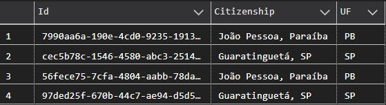
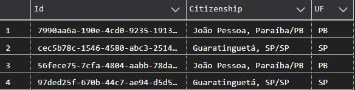

Sumário

 1. [Introdução](#introducao)
 2. [Declarando as variáveis](#declarando-as-variaveis)
 3. [Percorrendo os registros](#percorrendo-os-registros)
 4. [Manipulando os registros](#manipulando-os-registros)
 5. [Finalização e verificação](#finalizacao-e-verificacao)
 6. [Conclusão](#conclusao)
 7. [Referências](#referencias)
 
<div id='introducao'></div>

# Introdução

Cursores são estruturas de uma consulta onde podemos executar ações enquanto percorremos os registros. Neste artigo iremos montar um cursor com o objetivo de atualizar a cidadania de pessoas em uma tabela concatenando o campo `Citizenship` e `UF`.



Como os dois campos são referentes à cidadania da pessoa, dentro no "nosso negócio" o campo UF é visto como dispensável e antes de excluir precisamos fazer esta concatenação.

<div id='declarando-as-variaveis'></div>

# Declarando as variáveis

Então começamos declarando nossa transação como `ROLLBACK` para evitar que qualquer execução durante o processo de desenvolvimento seja persistida no banco (não queremos registrar valores errados, não é mesmo?). Logo em seguida declaramos as variáveis que utilizaremos.


O `id` será utilizado como referência ao registro na hora de manipular, As variáveis `personCitizenship` e `personUf` armazenarão os valores de cidadania e UF respectivamente.

```sql
BEGIN TRANSACTION

    DECLARE
        @id UNIQUEIDENTIFIER,
        @personCitizenship NVARCHAR(120),
        @personUF NVARCHAR(120)

ROLLBACK
```

<div id='percorrendo-os-registros'></div>

# Percorrendo os registros

Agora iremos declarar o cursor e atribuir os campos necessários para nossas modificações através de uma consulta ou `SELECT`

```sql
BEGIN TRANSACTION

    DECLARE
        @id UNIQUEIDENTIFIER,
        @personCitizenship NVARCHAR(120),
        @personUF NVARCHAR(120)

    -- 01. Percorrer os registros
    DECLARE [cur_Person_CitizenshipUF] CURSOR FOR
        SELECT
            [Id],
            [Citizenship],
            [UF]
        FROM
            [Person]

ROLLBACK
```

<div id='manipulando-os-registros'></div>

# Manipulando os registros

No passo `02` estamos abrindo nosso cursor e logo em seguida no passo `03` estamos lendo a próxima linha e associando as variáveis aos valores.

Logo em seguida no passo `04` declaramos nosso loop (laço) onde a linha de registro atual será atualizada com os valores das variáveis (passo `05`) especificando o `Id` para que não modifiquemos todos os registros ao mesmo tempo.

Finalizando temos o passo `06` que lê o próximo registro e atualiza os valores das variáveis, fazendo o loop recomeçar enquanto houver registros na tabela.

O Passo `07` fecha o nosso cursor encerrando nossas modificações.

```sql
BEGIN TRANSACTION

    DECLARE
        @id UNIQUEIDENTIFIER,
        @personCitizenship NVARCHAR(120),
        @personUF NVARCHAR(120)

    -- 01. Percorrer os registros
    DECLARE [cur_Person_CitizenshipUF] CURSOR FOR
        SELECT
            [Id],
            [Citizenship],
            [UF]
        FROM
            [Person]

    -- 02. Abrir cursor
    OPEN [cur_Person_CitizenshipUF]

    -- 03. Percorrer próxima linha
    FETCH NEXT FROM
        [cur_Person_CitizenshipUF]
    INTO
        @id,
        @personCitizenship,
        @personUF

    -- 04. Percorrer linhas do cursor
    WHILE @@FETCH_STATUS = 0
    BEGIN

        -- 05. Executar rotinas no registro
        UPDATE [Person]
            SET [Citizenship] = @personCitizenship + '/' + @personUF
        WHERE
            [Id] = @id
        
        -- 06. Ler o próximo registro
        FETCH NEXT FROM [cur_Person_CitizenshipUF] INTO @id, @personCitizenship, @personUF
    END

    -- 07. Encerrar leitura do cursor
    CLOSE [cur_Person_CitizenshipUF]
ROLLBACK
```

***`Nota 1:` A variável `@FETCH_STATUS` que está recebendo o valor 0 (zero) é uma função do tipo inteiro pré-existênte no SQL Server que retornar o estado do nosso `FETCH` do nosso cursor. Ou seja, enquanto houver registros atendendo às especificações, ele terá seu valor como 0 (zero). Ao chegar no fim dos registros ele modifica o valor para 1 (um).***

<div id='finalizacao-e-verificacao'></div>

# Finalização e verificação

Agora precisamos remover a referência ao nosso cursor criada na memória. Do contrário estaremos ocupando este recurso sem necessidade. Para isto vamos seguir conforme o passo `08`:

```sql
BEGIN TRANSACTION

    DECLARE
        @id UNIQUEIDENTIFIER,
        @personCitizenship NVARCHAR(120),
        @personUF NVARCHAR(120)

    -- 01. Percorrer os registros
    DECLARE [cur_Person_CitizenshipUF] CURSOR FOR
        SELECT
            [Id],
            [Citizenship],
            [UF]
        FROM
            [Person]

    -- 02. Abrir cursor
    OPEN [cur_Person_CitizenshipUF]

    -- 03. Percorrer próxima linha
    FETCH NEXT FROM
        [cur_Person_CitizenshipUF]
    INTO
        @id,
        @personCitizenship,
        @personUF

    -- 04. Percorrer linhas do cursor
    WHILE @@FETCH_STATUS = 0
    BEGIN

        -- 05. Executar rotinas no registro
        UPDATE [Person]
            SET [Citizenship] = @personCitizenship + '/' + @personUF
        WHERE
            [Id] = @id
        
        -- 06. Ler o próximo registro
        FETCH NEXT FROM [cur_Person_CitizenshipUF] INTO @id, @personCitizenship, @personUF
    END

    -- 07. Encerrar leitura do cursor
    CLOSE [cur_Person_CitizenshipUF]

    -- Finalizado o cursor
    DEALLOCATE [cur_Person_CitizenshipUF]
ROLLBACK
```

Com tudo concluído nós podemos então executar *ainda com rollback* e fazer um `SELECT` na nossa tabela para verificar se as modificações ocorreram como planejado.

```sql
SELECT
    [Id],
    [Citizenship],
    [UF]
FROM [Person]
```

Os valores resultantes devem ser semelhantes a os valores abaixo:



E agora que confirmamos que o código é executado corretamente podemos substituir o `ROLLBACK` por `COMMIT` na nossa transação para persistir as informações quando executarmos novamente o script. E finalizando podemos excluir a coluna `UF`:

```sql
ALTER TABLE [Person]
    DROP COLUMN [UF]
GO
```

<div id='conclusao'></div>

# Conclusão

Agora que você conhece como funciona a estrutura básica de um cursor poderá exercitar criando diversas rotinas referentes ao seu projeto, você também pode adicionar estes cursos em stored procedures.


<div id='referencias'></div> 

# Referências
[Declare cursor - Documentação da Microsoft](https://docs.microsoft.com/pt-br/sql/t-sql/language-elements/declare-cursor-transact-sql?view=sql-server-ver15)

[@@FETCH_STATUS - Documentação da Microsoft](https://docs.microsoft.com/en-us/sql/t-sql/functions/fetch-status-transact-sql?view=sql-server-ver15)

[DEALLOCATE - Documentação da Microsoft](https://docs.microsoft.com/en-us/sql/t-sql/language-elements/deallocate-transact-sql?view=sql-server-ver15)
