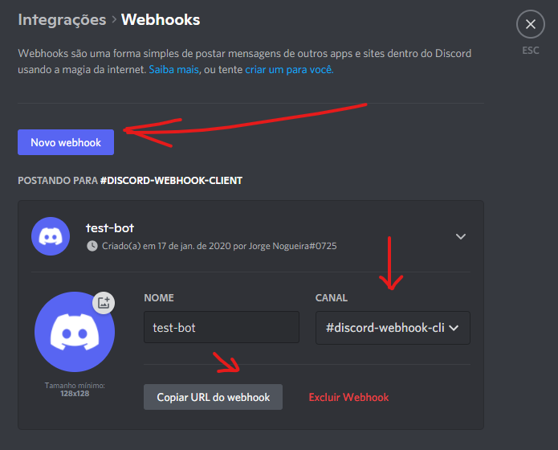
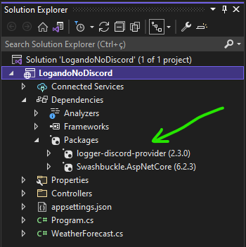
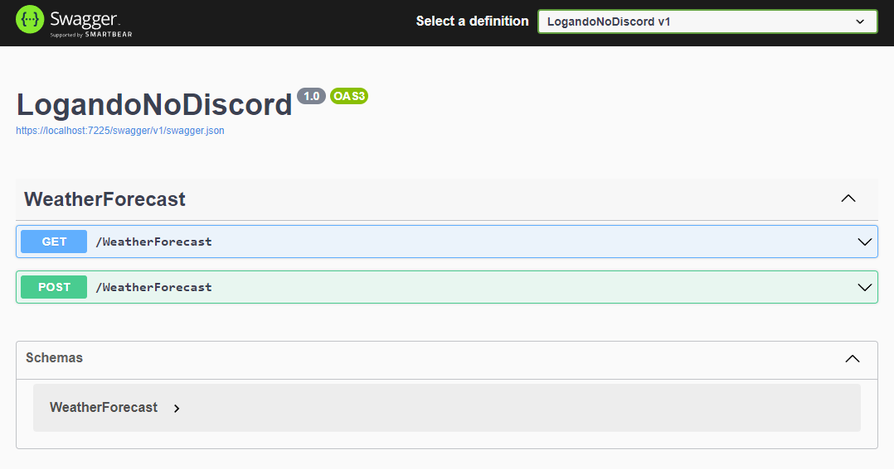
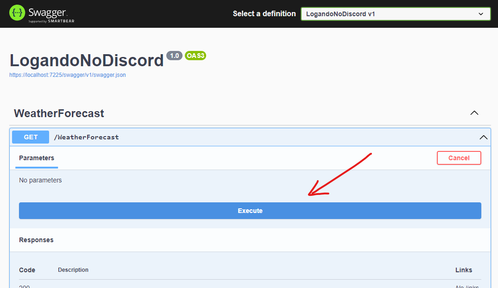
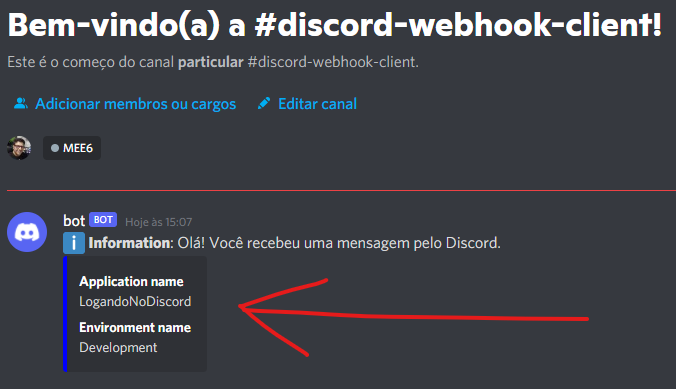
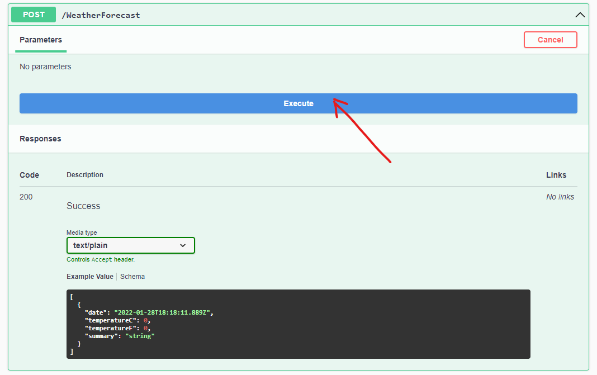
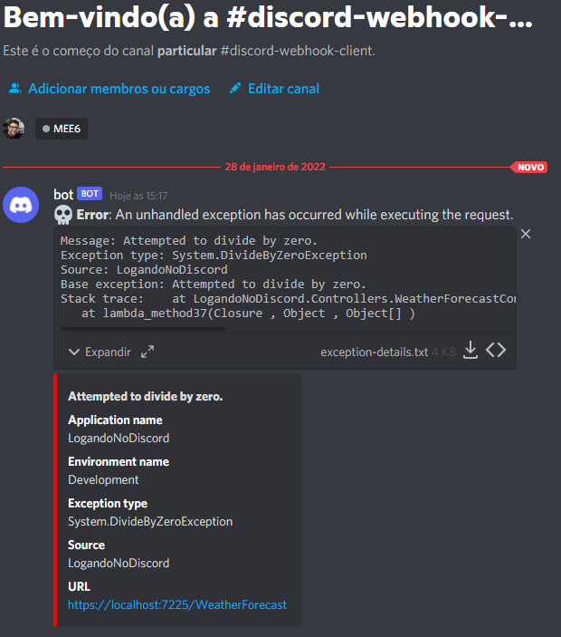

O **Discord** (https://discordapp.com/) é uma plataforma de comunicação e com o tempo passou a ser uma opção para gerenciamento de times, concorrendo com o Microsoft Teams e o Slack. Ele, que inicialmente tinha um foco maior para o público gamer, hoje tenta se firmar como um aplicativo de mensagens para o público geral. O próprio **balta.io** (https://balta.io/) utiliza o Discord como ferramenta de comunicação entre os seus alunos!

O Discord também disponibiliza uma rica API (https://discord.com/developers/docs/intro) que permite a integração com a plataforma. Uma das features dessa API é a utilização de *webhooks* para o envio de mensagens para a plataforma.

### Motivação

Já que o Discord é uma plataforma tão interessante, por que não utilizá-la para nos avisar quando um evento relevante ocorrer em nossas aplicações .NET (por exemplo, a realização de uma compra em uma loja de e-commerce, a ocorrência de uma exception, etc)? Essa necessidade surgiu para mim, no desenvolvimento de um projeto em .NET: quando um processo desse projeto fosse concluído com sucesso, eu gostaria de receber uma mensagem no Discord me avisando da conclusão! 

Pensando nessa necessidade criei dois pacotes:
- **Discord Webhook Client** (https://github.com/jlnpinheiro/discord-webhook-client) que utiliza *webhooks* do Discord para envio de mensagens
- **Discord .NET Logger Provider** (https://github.com/jlnpinheiro/logger-discord-provider) utiliza o componente "Discord Webhook Client" e a cria um provider para a biblioteca *Microsoft.Extensions.Logging*, permitindo enviar para o Discord eventos ocorridos em uma aplicação .NET .

### Criando um webhook no Discord

Os webhooks nada mais são do que uma URL criada para um canal do Discord. Essa URL, ao receber um request, envia uma mensagem para o seu respectivo canal. Para mais informações de como criar um webhook para um canal do Discord, consulte https://support.discord.com/hc/en-us/articles/228383668-Intro-to-Webhooks

Para esse artigo eu criei um canal chamado **#discord-webhook-client** e para ele realizei a crianção de um webhook:



### Iniciando o projeto

Nesse exemplo utilizaremos um projeto **ASP.NET Core Web API** utilizando .NET 6. Para criar o projeto utilizaremos o comando:

```dotnet new webapi -o LogandoNoDiscord```

Projeto criado, basta abrí-lo no seu editor ou IDE favorito (eu particularmente utilizo o Visual Studio 2022 Community).

### Adicionando o pacote

Iremos utilizar o pacote:

- logger-discord-provider

Utilizaremos o comando abaixo para adicionar o pacote (dentro da pasta "LogandoNoDiscord" onde o projeto foi criado):

```dotnet add package logger-discord-provider```

### Configurando o projeto

Criado o projeto e adicionado o pacote, ao abrirmos o projeto no VS 2022 teremos a seguinte estrutura:



Vamos alterar o arquivo **Program.cs**, adicionando as modificações necessárias para a utilização do pacote:

```csharp
using JNogueira.Logger.Discord; // <-- Adicionamos a namespace do pacote

var builder = WebApplication.CreateBuilder(args);

// Add services to the container.
builder.Services.AddHttpContextAccessor(); // <-- Adicionamos a injeção de dependência

builder.Services.AddControllers();
// Learn more about configuring Swagger/OpenAPI at https://aka.ms/aspnetcore/swashbuckle
builder.Services.AddEndpointsApiExplorer();
builder.Services.AddSwaggerGen();

var app = builder.Build();

// Configure the HTTP request pipeline.
if (app.Environment.IsDevelopment())
{
    app.UseSwagger();
    app.UseSwaggerUI();
}

app.UseHttpsRedirection();

app.UseAuthorization();

app.MapControllers();

using (var scope = app.Services.CreateScope())
{
    var httpContext = scope.ServiceProvider.GetRequiredService<IHttpContextAccessor>();

    var loggerFactory = scope.ServiceProvider.GetRequiredService<ILoggerFactory>(); // <-- Obtemos uma instância de LoggerFactory para adicionar o provider do Discord.

    // Adiciona o logger provider para o Discord.
    loggerFactory.AddDiscord(new DiscordLoggerOptions(app.Configuration["DiscordWebhookUrl"]) // <-- URL do webhook do Discord por onde as mensagens serão enviadas
    {
        ApplicationName = "LogandoNoDiscord", // <-- Nome da nossa aplicação
        EnvironmentName = app.Environment.EnvironmentName, // <-- Ambiente em qual a aplicação está sendo executada
        UserName = "bot" // <-- Nome do usuário responsável pelo envio da mensagem no canal do Discord (pode ser qualquer nome).
    }, httpContext);
}

app.Run();
```

No arquivo de configuração *appSettings.json* devemos colocar a URL do webhook que será utilizada:

```json
{
  "DiscordWebhookUrl": "https://discord.com/api/webhooks/..."
}
```

### Enviando mensagens para o Discord

No projeto existe o controller **WeatherForecastController**. Iremos alterar a rota *HttpGet* (método **Get**), incluindo a chamada ao método **LogInformation** de *ILogger*:

```csharp
[HttpGet(Name = "GetWeatherForecast")]
public IEnumerable<WeatherForecast> Get()
{
    _logger.LogInformation("Olá! Você recebeu uma mensagem pelo Discord."); // <-- Envia a mensagem para o canal do Discord (via webhook)
    
    return Enumerable.Range(1, 5).Select(index => new WeatherForecast
    {
        Date = DateTime.Now.AddDays(index),
        TemperatureC = Random.Shared.Next(-20, 55),
        Summary = Summaries[Random.Shared.Next(Summaries.Length)]
    })
    .ToArray();
}
```

Alterado o método **GET**, vamos rodar o projeto (CTRL + F5 no VS 2022 ou com o comando ```dotnet run```). A página abaixo deverá ser visualizada:



Expandindo a rota **GET**, clique no botão **Try it out** em seguida em **Execute**.



 Ao fazer isso, você deverá receber a seguinte mensagem no canal do Discord:

 

 ### Logando exceptions no Discord

 Outra aplicação do componente é utilizá-lo para enviar detalhes de uma exception disparada para um canal do Discord. 

 No projeto, vamos agora alterar a rota *HttpPost* (método **POST**), forçando que uma exception seja disparada (*DivideByZeroException*):

 ```csharp
[HttpPost(Name = "GetWeatherForecast")]
public IEnumerable<WeatherForecast> GetWeatherForecast()
{
    var i = 0;

    var x = 5 / i; // <-- Dispara a exception em runtime

    return new List<WeatherForecast>();
}
 ```
 Alterado o método **POST**, vamos rodar o projeto novamente. Exibida a página da API, vamos agora clicar no botão **Try it out** e em  **Execute** da rota **POST**: 

 

 Ao fazer isso, você deverá receber a seguinte mensagem no canal do Discord:

  

  No registro de exceptions, a mensagem enviada para o Discord contém um arquivo txt (exception-details.txt) com informações relacionadas a exception disparada (tipo da exception, base exception, stack trace, request headers).

Com isso finalizamos nosso projeto!

  ### Considerações finais

 O Discord é uma plataforma que conta com uma API muito rica e possibilita a utilização de vários outros recursos. Para maiores informações acesse https://discord.com/developers/docs/intro . 

 O repositório do componente **Discord .NET Logger Provider** está disponível em https://github.com/jlnpinheiro/discord-webhook-client. 

 O projeto utilizado nesse artigo está disponível em: https://github.com/jlnpinheiro/logando-no-discord

Espero que tenham gostado do artigo e que o pacote seja útil! 
Um grande abraço! 

